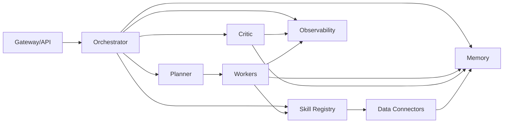
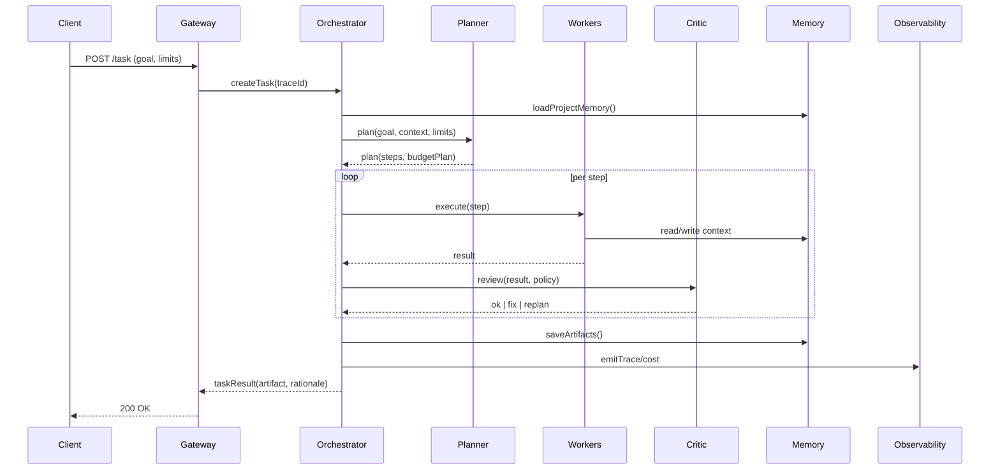

# PrometheusULTIMATE v4 — AGI Platform  
Aвтор MagistrTheOne|Father AI
Версия: 0.9 (draft) 

## 🎯 Цели релиза v4

- **Единый вход → план → исполнение → артефакт** (файл/код/таблица) + объяснимость
- **Комбо-инференс**: узкие модели/инструменты по требованию, а не держим всё всегда
- **Стоимость/время осведомлённость**: планировщик управляет $ и SLAs
- **Двойной контроль**: критик перепроверяет рискованные шаги
- **Проектная память**: задачи живут неделями, контекст не теряется
- **Наблюдаемость**: трейсинг шагов, метрики, стоимость, журнал решений

## 🏗️ Архитектура (System Architecture and Control Flow)

### Компоненты системы



### Последовательность выполнения задачи



## 🚀 Быстрый старт

### Предварительные требования

- Python 3.11+
- Docker & Docker Compose
- Windows PowerShell или Linux/macOS shell

### Установка

1. **Клонирование и настройка окружения:**
```bash
git clone <repository>
cd PrometheusULTIMATE
make install
```

2. **Запуск платформы:**
```bash
make up
```

3. **Проверка здоровья сервисов:**
```bash
make health
```

4. **Просмотр доступных моделей:**
```bash
make models
```

### Создание первой задачи

```bash
make task GOAL="создай отчёт по продажам за сентябрь"
```

## 📡 API Endpoints

### Gateway (порт 8090)

- `GET /health` — проверка здоровья
- `GET /models` — реестр моделей (статус training)
- `POST /task` — создание задачи
- `GET /task/{id}` — статус задачи
- `POST /memory/save` — сохранение в память
- `GET /memory/search` — поиск в памяти
- `POST /skill/register` — регистрация навыка
- `POST /skill/run` — выполнение навыка
- `POST /feedback` — отправка обратной связи

### Memory Service (порт 8003)

- `GET /health` — проверка здоровья
- `POST /save` — сохранение элемента
- `GET /search` — поиск по памяти
- `GET /facts/{project_id}` — получение фактов
- `GET /artifacts/{project_id}` — получение артефактов
- `GET /policies/{project_id}` — получение политик
- `GET /events/{project_id}` — получение событий

## 🧠 Реестр моделей

| ID | Семейство | Размер | Статус | Роль |
|---|---|---|---|---|
| `MagistrTheOne/RadonSAI-Small` | Radon | 0.1B | **ready** | оффлайн-витрина, быстрые утилиты |
| `MagistrTheOne/RadonSAI` | Radon | 0.8B | **ready** | общий чат/навыки на слабом железе |
| `MagistrTheOne/RadonSAI-Balanced` | Radon | 0.8B | **ready** | основной рабочий инструктор |
| `MagistrTheOne/RadonSAI-Efficient` | Radon | 0.8B | **ready** | дешёвый прод-трафик |
| `MagistrTheOne/RadonSAI-Pretrained` | Radon | 0.8B | **ready** | базовая модель для SFT |
| `MagistrTheOne/RadonSAI-Ultra` | Radon | 0.8B | **ready** | сложные задачи, код |
| `MagistrTheOne/RadonSAI-Mega` | Radon | 0.8B | **ready** | витрина качества |
| `MagistrTheOne/RadonSAI-GPT5Competitor` | Radon | 0.8B | **ready** | флагман-витрина |
| `MagistrTheOne/RadonSAI-DarkUltima` | Radon | 0.8B | training | эксперименты/тёмные режимы |
| `MagistrTheOne/oracle850b-moe` | Oracle | 850B | **ready** | R&D, не в MVP |

> **Обновлено**: Большинство моделей RadonSAI готовы к использованию! Статус `ready` означает наличие весов в HuggingFace.

## 🛠️ Навыки (Skills)

### Планируемые навыки (10 штук)

1. **csv_join** — соединение CSV файлов по колонке
2. **csv_clean** — очистка и нормализация данных
3. **http_fetch** — получение данных по HTTP (с allowlist)
4. **sql_query** — выполнение SQL запросов (readonly)
5. **plot_basic** — создание базовых графиков
6. **ocr_stub** — извлечение текста из изображений
7. **code_format** — форматирование кода
8. **math_calc** — математические вычисления
9. **file_zip** — архивирование файлов
10. **email_draft** — создание черновиков писем

### Требования к навыку

- Декларация прав (fs/net/time/ram)
- Идемпотентность/детерминированность
- Юнит-тесты и dry-run до публикации
- Песочница с rlimit (CPU/RAM/время)

## 💾 Система памяти

### Компоненты

- **Vector (Qdrant)**: коллекции per project, payload с метаданными
- **KV (SQLite)**: таблицы facts, artifacts, policies, events
- **RAG-pattern**: search → clip → critic verification → context

### Типы памяти

- **Краткая (in-task)**: контекст шагов, артефакты
- **Долгая**: векторный индекс (тексты, коды), KV (метаданные, флаги)
- **Проектная**: файлы, артефакты, версии, ссылки на источники

## 🔒 Безопасность

- `DISALLOW_EXTERNAL_PROVIDERS=true` — запрет внешних провайдеров
- Навыки запускаются в subprocess с rlimit
- FS read-only для кода, отдельный tmpfs для данных
- Сеть off by default, явный allowlist
- PII-redaction на записи

## 📊 Наблюдаемость

- **Trace ID** на задачу и шаг
- События: plan_started, step_run, critic_fix, artifact_saved
- **Стоимость**: учёт CPU-сек, IO, внешних вызовов
- Журнал решений: «почему выбрали этот путь»
- Экспорт JSONL

## 🧪 Тестирование

### Unit тесты
```bash
make test
```

### E2E тесты
```bash
make e2e
```

### Линтинг и форматирование
```bash
make fmt
make lint
```

## 📈 Метрики и SLO

- Успешность задач ≥ **90%** на эталоне
- Ложные факты ≤ **2%** на проверяемых шагах
- Средняя задержка ≤ **10 с** (типовые задачи)
- Себестоимость: трекинг $/задачу, отчёт пост-фактум

## 🗂️ Структура проекта

```
PrometheusULTIMATE/
├── apps/                    # Микросервисы
│   ├── gateway/            # HTTP API + маршрутизация
│   ├── orchestrator/       # управление жизненным циклом задач
│   ├── planner/            # cost/time-aware планирование
│   ├── critic/             # валидация фактов/кода/политик
│   └── ui/                # read-only дашборд
├── libs/                   # Общие библиотеки
│   ├── skills/            # SDK, registry, sandbox
│   ├── memory/            # Qdrant + SQLite
│   ├── observability/     # трейсинг, метрики, стоимость
│   └── common/            # shared utils, schemas
├── examples/skills/       # 10 ручных навыков
├── tests/                 # Тесты
│   ├── unit/
│   ├── integration/
│   └── e2e/
├── infra/                 # Инфраструктура
│   ├── docker-compose.yml
│   └── configs/
├── .promu/               # Данные платформы
│   ├── models/          # Реестр моделей
│   ├── qdrant/          # Векторная БД
│   └── kv.db           # KV хранилище
├── requirements.txt
├── Makefile
└── README.md
```

## 🛠️ Команды разработки

### Основные команды
```bash
make help          # Показать все команды
make up            # Запустить все сервисы
make down          # Остановить все сервисы
make logs          # Показать логи
make health        # Проверить здоровье сервисов
```

### Разработка
```bash
make dev           # Запустить gateway в dev режиме
make gateway       # Только gateway сервис
make memory        # Только memory сервис
make fmt           # Форматировать код
make lint          # Проверить код
```

### Тестирование
```bash
make test          # Unit тесты
make e2e           # E2E тесты
make ci-test       # Тесты для CI
```

### Мониторинг
```bash
make models        # Показать модели
make monitor       # Показать использование ресурсов
make docs          # Показать ссылки на документацию
```


