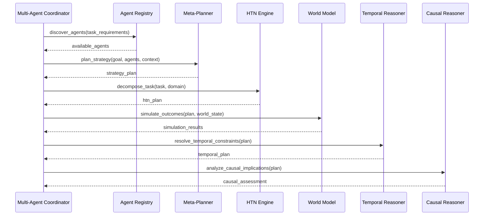

# Cognitive Components Specification

## 1. Multi-Agent Architecture

### Agent Registry Service

**Цель**: Управление жизненным циклом специализированных агентов в swarm intelligence системе.

#### Core Capabilities

**Agent Types**:
- **Researcher**: Анализ задач, сбор информации, генерация гипотез
- **Executor**: Выполнение конкретных действий и операций
- **Validator**: Проверка результатов, quality assurance
- **Learner**: Обучение на опыте, адаптация стратегий
- **Coordinator**: Управление командной работой агентов

**Capability System**:
```python
@dataclass
class AgentCapability:
    name: str
    domain: str  # "planning", "execution", "learning", "safety"
    confidence: float  # 0.0-1.0
    resource_requirements: Dict[str, float]
    specialization_score: float

class AgentRegistry:
    async def register_agent(self, agent_spec: AgentSpec) -> AgentId
    async def discover_agents(self, capabilities: List[str], domain: str) -> List[AgentInfo]
    async def get_agent_status(self, agent_id: AgentId) -> AgentStatus
    async def update_capabilities(self, agent_id: AgentId, capabilities: List[AgentCapability])
```

#### API Specification

```yaml
paths:
  /agents:
    post:
      summary: Регистрация нового агента
      requestBody:
        content:
          application/json:
            schema:
              $ref: '#/components/schemas/AgentSpec'
      responses:
        '201':
          description: Агент зарегистрирован
          content:
            application/json:
              schema:
                $ref: '#/components/schemas/AgentInfo'

    get:
      summary: Получение списка агентов с фильтрами
      parameters:
        - name: domain
          in: query
          schema:
            type: string
        - name: capability
          in: query
          schema:
            type: string
        - name: min_confidence
          in: query
          schema:
            type: number
            minimum: 0.0
            maximum: 1.0
      responses:
        '200':
          content:
            application/json:
              schema:
                type: array
                items:
                  $ref: '#/components/schemas/AgentInfo'

  /agents/{agent_id}/status:
    get:
      summary: Получение статуса агента
      parameters:
        - name: agent_id
          in: path
          required: true
          schema:
            type: string
      responses:
        '200':
          content:
            application/json:
              schema:
                $ref: '#/components/schemas/AgentStatus'

    put:
      summary: Обновление статуса агента
      requestBody:
        content:
          application/json:
            schema:
              $ref: '#/components/schemas/AgentStatusUpdate'
```

#### Negotiation Protocol

**Resource Negotiation**:
```python
class NegotiationEngine:
    async def negotiate_resources(self, requester: AgentId, requirements: ResourceRequirements) -> NegotiationResult
    async def allocate_resources(self, allocation: ResourceAllocation) -> bool
    async def release_resources(self, agent_id: AgentId, resources: List[str]) -> bool

@dataclass
class ResourceRequirements:
    cpu_cores: int
    gpu_memory_gb: float
    ram_gb: float
    network_bandwidth_mbps: float
    priority: int  # 1-10, higher = more critical

@dataclass
class NegotiationResult:
    granted: bool
    allocated_resources: Dict[str, float]
    alternatives: List[Dict[str, float]]  # fallback options
    negotiation_log: List[str]
```

#### Dynamic Team Formation

**Team Assembly Algorithm**:
```python
class TeamFormationEngine:
    async def form_team(self, task: TaskSpec, available_agents: List[AgentInfo]) -> TeamSpec

    def calculate_team_synergy(self, agents: List[AgentInfo], task: TaskSpec) -> float:
        # Calculate complementary capabilities
        # Assess communication overhead
        # Evaluate resource sharing efficiency
        pass

    def optimize_team_composition(self, task_complexity: float, deadline: datetime) -> TeamConfig:
        # Balance specialization vs generalists
        # Consider agent fatigue and load
        # Optimize for communication patterns
        pass
```

## 2. Hierarchical Task Networks (HTN) Planner

### Meta-Planner Component

**Цель**: Стратегическое планирование на высоком уровне абстракции.

#### Architecture

```python
class MetaPlanner:
    async def plan_strategy(self, goal: Goal, context: Context) -> StrategyPlan

    def evaluate_strategies(self, strategies: List[Strategy]) -> List[StrategyScore]:
        # Cost-benefit analysis
        # Risk assessment
        # Resource efficiency
        # Time-to-completion estimation
        pass

    def select_optimal_strategy(self, scores: List[StrategyScore]) -> Strategy:
        # Multi-objective optimization
        # Constraint satisfaction
        # Preference weighting
        pass

@dataclass
class StrategyPlan:
    primary_strategy: Strategy
    fallback_strategies: List[Strategy]
    risk_assessment: RiskProfile
    resource_forecast: ResourceForecast
    timeline: Timeline
```

#### HTN Engine

**Task Decomposition**:
```python
class HTNEngine:
    async def decompose_task(self, task: Task, domain: HTNDomain) -> HTNPlan

    def find_applicable_methods(self, task: Task, state: State) -> List[Method]:
        # Pattern matching against task preconditions
        # Capability matching with available agents
        # Resource availability checking
        pass

    def generate_plan(self, initial_task: Task, domain: HTNDomain) -> PlanGraph:
        # Recursive decomposition
        # Ordering constraints resolution
        # Resource conflict resolution
        pass

@dataclass
class HTNTask:
    name: str
    parameters: Dict[str, Any]
    preconditions: List[Condition]
    effects: List[Effect]

@dataclass
class HTNMethod:
    name: str
    task: HTNTask
    preconditions: List[Condition]
    subtasks: List[HTNTask]
    ordering_constraints: List[OrderingConstraint]
```

### Temporal Reasoning

**Sequence Planning**:
```python
class TemporalReasoner:
    def reason_about_sequences(self, events: List[Event], constraints: List[Constraint]) -> TemporalPlan

    def detect_conflicts(self, plan: Plan) -> List[Conflict]:
        # Resource conflicts over time
        # Causal dependency violations
        # Deadline violations
        pass

    def resolve_conflicts(self, conflicts: List[Conflict]) -> ConflictResolution:
        # Constraint relaxation
        # Resource reallocation
        # Schedule optimization
        pass

@dataclass
class TemporalConstraint:
    type: str  # "before", "after", "during", "meets"
    task_a: str
    task_b: str
    time_window: Optional[TimeWindow]

@dataclass
class TimeWindow:
    start: datetime
    end: datetime
    flexibility: timedelta  # how much can be adjusted
```

## 3. World Model Engine

### Predictive Modeling

**Цель**: Создание и поддержка модели окружающего мира для планирования и симуляции.

#### World State Representation

```python
@dataclass
class WorldState:
    timestamp: datetime
    entities: Dict[str, Entity]
    relationships: List[Relationship]
    probabilities: Dict[str, float]  # uncertainty quantification
    causal_graph: nx.DiGraph

@dataclass
class Entity:
    id: str
    type: str  # "agent", "object", "environment", "resource"
    properties: Dict[str, Any]
    state_vector: np.ndarray
    uncertainty_matrix: np.ndarray

@dataclass
class Relationship:
    type: str  # "causes", "enables", "prevents", "requires"
    from_entity: str
    to_entity: str
    strength: float
    evidence: List[Evidence]
```

#### Simulation Engine

**Mental Experiments**:
```python
class SimulationEngine:
    async def run_simulation(self, initial_state: WorldState, actions: List[Action], steps: int) -> SimulationResult

    def predict_outcomes(self, state: WorldState, action: Action) -> OutcomeDistribution:
        # Monte Carlo sampling
        # Causal inference
        # Uncertainty propagation
        pass

    def evaluate_action_utility(self, action: Action, state: WorldState, goal: Goal) -> UtilityScore:
        # Expected value calculation
        # Risk assessment
        # Opportunity cost analysis
        pass

@dataclass
class SimulationResult:
    final_states: List[WorldState]
    action_sequence: List[Action]
    outcome_probabilities: Dict[str, float]
    utility_trajectory: List[float]
    causal_explanations: List[str]
```

### Causal Reasoning Engine

**Causal Analysis**:
```python
class CausalReasoner:
    def analyze_causality(self, events: List[Event]) -> CausalGraph

    def predict_effects(self, cause: Event, context: Context) -> EffectDistribution:
        # Counterfactual reasoning
        # Intervention analysis
        # Confounding detection
        pass

    def explain_decision(self, decision: Decision, context: Context) -> CausalExplanation:
        # Root cause analysis
        # Alternative path exploration
        # Confidence assessment
        pass

@dataclass
class CausalRelationship:
    cause: Event
    effect: Event
    strength: float
    confidence: float
    mechanisms: List[str]  # how cause leads to effect
    evidence: List[Evidence]
    counterfactuals: List[str]  # "what if" scenarios
```

## Integration Architecture

### Component Communication



### Data Flow

**Planning Pipeline**:
```
Task Input → Agent Discovery → Strategy Selection → Task Decomposition
→ World Simulation → Temporal Resolution → Causal Analysis → Execution Plan
```

**Learning Feedback Loop**:
```
Execution Results → World Model Update → Causal Graph Refinement
→ Strategy Performance Analysis → Meta-Planner Adaptation → Agent Capability Updates
```

## Performance Requirements

### Latency Targets
- **Agent Discovery**: < 100ms
- **Strategy Planning**: < 500ms
- **Task Decomposition**: < 200ms
- **World Simulation**: < 1s per simulation step
- **Causal Analysis**: < 300ms

### Accuracy Targets
- **Agent Matching**: > 95% precision
- **Strategy Selection**: > 90% optimal choice rate
- **Causal Reasoning**: > 85% accurate predictions
- **Simulation Fidelity**: > 80% real-world correlation

### Scalability Targets
- **Concurrent Agents**: 1000+ simultaneous
- **Plan Complexity**: 1000+ subtasks
- **World State Size**: 10M+ entities
- **Causal Graph Depth**: 50+ levels

## Safety Considerations

### Validation Checks
- **Agent Compatibility**: Verify capability matches before assignment
- **Resource Limits**: Prevent resource exhaustion
- **Plan Feasibility**: Validate temporal and causal constraints
- **Risk Assessment**: Evaluate high-risk strategies

### Failure Handling
- **Plan B Execution**: Automatic fallback to alternative strategies
- **Graceful Degradation**: Continue with reduced functionality
- **Error Recovery**: Rollback and retry mechanisms
- **Human Intervention**: Escalation triggers for complex failures

## Testing Strategy

### Unit Tests
- Individual algorithm correctness
- Edge case handling
- Performance benchmarks
- Memory leak detection

### Integration Tests
- Component interaction verification
- End-to-end planning pipelines
- Multi-agent coordination scenarios
- World model accuracy validation

### Stress Tests
- High concurrency scenarios
- Large-scale planning problems
- Memory pressure situations
- Network failure simulations

## Deployment Configuration

### H200 Optimization
```yaml
cognitive_services:
  agent_registry:
    gpu_memory_gb: 8
    cpu_cores: 4
    replicas: 3

  meta_planner:
    gpu_memory_gb: 16
    cpu_cores: 8
    replicas: 2

  world_model:
    gpu_memory_gb: 64
    cpu_cores: 16
    replicas: 1

  htn_engine:
    gpu_memory_gb: 4
    cpu_cores: 2
    replicas: 5
```

### Monitoring
- **Agent Health**: Registration status, capability updates
- **Planning Metrics**: Success rates, planning times, plan quality
- **World Model**: Prediction accuracy, simulation coverage
- **Resource Usage**: GPU/CPU utilization, memory consumption
