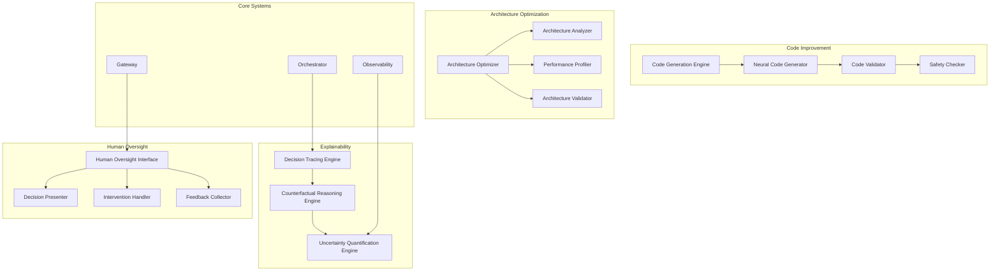

# Self-Improvement & Explainability Specification

## 1. Self-Improvement Loops

### Code Generation and Testing Engine

**Цель**: Автоматическое улучшение собственного кода системы через генерацию, тестирование и валидацию.

#### Code Generation System

```python
class CodeGenerationEngine:
    def __init__(self, config: CodeGenerationConfig):
        self.code_generator = NeuralCodeGenerator(config.neural_generation)
        self.code_validator = CodeValidator(config.validation)
        self.performance_analyzer = PerformanceAnalyzer(config.performance_analysis)
        self.safety_checker = CodeSafetyChecker(config.safety_checking)

    async def generate_code_improvement(self, target_component: ComponentSpec, improvement_goal: ImprovementGoal) -> CodeImprovement:
        # Analyze current code
        current_analysis = await self.analyze_current_code(target_component)

        # Identify improvement opportunities
        improvement_opportunities = await self.identify_improvements(
            current_analysis, improvement_goal
        )

        # Generate improved code variants
        code_variants = await asyncio.gather(*[
            self.generate_code_variant(target_component, opportunity)
            for opportunity in improvement_opportunities
        ])

        # Validate generated code
        validation_results = await asyncio.gather(*[
            self.validate_code_variant(variant, target_component)
            for variant in code_variants
        ])

        # Select best improvement
        best_improvement = await self.select_best_improvement(
            code_variants, validation_results, improvement_goal
        )

        # Safety check before deployment
        safety_clearance = await self.safety_checker.check_safety(best_improvement)

        return CodeImprovement(
            target_component=target_component,
            improvement_goal=improvement_goal,
            generated_variants=code_variants,
            validation_results=validation_results,
            selected_improvement=best_improvement,
            safety_clearance=safety_clearance,
            expected_performance_gain=self.estimate_performance_gain(
                current_analysis, best_improvement
            ),
            risk_assessment=self.assess_improvement_risks(best_improvement)
        )

@dataclass
class ComponentSpec:
    name: str
    file_path: str
    component_type: str  # "service", "library", "model", "algorithm"
    current_version: str
    dependencies: List[str]
    performance_metrics: Dict[str, float]

@dataclass
class ImprovementGoal:
    type: str  # "performance", "efficiency", "safety", "functionality"
    target_metric: str
    improvement_target: float  # percentage or absolute value
    constraints: List[str]
    priority: int
```

#### Neural Code Generator

```python
class NeuralCodeGenerator:
    def __init__(self, config: NeuralGenerationConfig):
        self.generation_model = CodeGenerationModel(config.model)
        self.code_templates = CodeTemplateLibrary(config.templates)
        self.context_analyzer = CodeContextAnalyzer(config.context)
        self.quality_filter = QualityFilter(config.quality_filtering)

    async def generate_code_variant(self, component: ComponentSpec, opportunity: ImprovementOpportunity) -> CodeVariant:
        # Extract code context
        context = await self.context_analyzer.extract_context(component)

        # Select appropriate template
        template = await self.code_templates.select_template(opportunity.type, context)

        # Generate code using neural model
        generated_code = await self.generation_model.generate(
            template=template,
            context=context,
            improvement_spec=opportunity.specification
        )

        # Apply quality filtering
        filtered_code = await self.quality_filter.filter_and_improve(generated_code)

        # Validate syntax and structure
        validation_result = await self.validate_generated_code(filtered_code, component.language)

        return CodeVariant(
            base_component=component,
            improvement_opportunity=opportunity,
            generated_code=filtered_code,
            template_used=template.name,
            generation_metadata=self.extract_generation_metadata(generated_code),
            validation_result=validation_result,
            quality_score=self.assess_code_quality(filtered_code)
        )
```

#### Code Validation and Testing

```python
class CodeValidator:
    def __init__(self, config: ValidationConfig):
        self.syntax_checker = SyntaxChecker(config.syntax)
        self.type_checker = TypeChecker(config.types)
        self.unit_test_generator = UnitTestGenerator(config.unit_tests)
        self.integration_tester = IntegrationTester(config.integration)
        self.performance_tester = PerformanceTester(config.performance)

    async def validate_code_variant(self, variant: CodeVariant, target_component: ComponentSpec) -> ValidationResult:
        # Syntax validation
        syntax_result = await self.syntax_checker.check_syntax(variant.generated_code)

        if not syntax_result.valid:
            return ValidationResult(
                valid=False,
                validation_type="syntax",
                errors=syntax_result.errors,
                passed_tests=[],
                failed_tests=["syntax_check"],
                performance_metrics=None
            )

        # Type checking
        type_result = await self.type_checker.check_types(
            variant.generated_code, target_component
        )

        # Generate and run unit tests
        unit_tests = await self.unit_test_generator.generate_tests(variant, target_component)
        unit_results = await self.run_tests(unit_tests)

        # Integration testing
        integration_tests = await self.integration_tester.generate_integration_tests(
            variant, target_component
        )
        integration_results = await self.run_tests(integration_tests)

        # Performance testing
        performance_result = await self.performance_tester.test_performance(
            variant, target_component
        )

        # Overall validation result
        all_tests_passed = (
            syntax_result.valid and
            type_result.valid and
            unit_results.all_passed and
            integration_results.all_passed and
            performance_result.meets_requirements
        )

        return ValidationResult(
            valid=all_tests_passed,
            validation_type="comprehensive",
            errors=self.collect_all_errors(syntax_result, type_result, unit_results, integration_results),
            passed_tests=self.collect_passed_tests(unit_results, integration_results),
            failed_tests=self.collect_failed_tests(unit_results, integration_results),
            performance_metrics=performance_result.metrics
        )
```

### Architecture Optimization Engine

**Цель**: Автоматическое улучшение системной архитектуры для повышения производительности и эффективности.

#### Architecture Analysis and Optimization

```python
class ArchitectureOptimizer:
    def __init__(self, config: ArchitectureOptimizationConfig):
        self.architecture_analyzer = ArchitectureAnalyzer(config.analysis)
        self.performance_profiler = PerformanceProfiler(config.profiling)
        self.optimization_engine = OptimizationEngine(config.optimization)
        self.architecture_validator = ArchitectureValidator(config.validation)

    async def optimize_architecture(self, current_architecture: SystemArchitecture, optimization_goals: List[OptimizationGoal]) -> ArchitectureOptimization:
        # Analyze current architecture
        architecture_analysis = await self.architecture_analyzer.analyze_architecture(current_architecture)

        # Profile performance bottlenecks
        performance_profile = await self.performance_profiler.profile_system(current_architecture)

        # Identify optimization opportunities
        optimization_opportunities = await self.identify_optimization_opportunities(
            architecture_analysis, performance_profile, optimization_goals
        )

        # Generate optimized architecture variants
        architecture_variants = await asyncio.gather(*[
            self.generate_optimized_variant(current_architecture, opportunity)
            for opportunity in optimization_opportunities
        ])

        # Validate architecture variants
        validation_results = await asyncio.gather(*[
            self.architecture_validator.validate_variant(variant)
            for variant in architecture_variants
        ])

        # Select best architecture
        best_architecture = await self.select_best_architecture(
            architecture_variants, validation_results, optimization_goals
        )

        # Generate migration plan
        migration_plan = await self.generate_migration_plan(
            current_architecture, best_architecture
        )

        return ArchitectureOptimization(
            current_architecture=current_architecture,
            optimization_goals=optimization_goals,
            identified_opportunities=optimization_opportunities,
            generated_variants=architecture_variants,
            validation_results=validation_results,
            selected_architecture=best_architecture,
            migration_plan=migration_plan,
            expected_improvements=self.estimate_improvements(best_architecture, current_architecture),
            risk_assessment=self.assess_migration_risks(migration_plan)
        )

@dataclass
class SystemArchitecture:
    services: Dict[str, ServiceSpec]
    data_flows: List[DataFlow]
    communication_patterns: List[CommunicationPattern]
    resource_allocations: Dict[str, ResourceAllocation]
    scalability_config: ScalabilityConfig

@dataclass
class OptimizationGoal:
    metric: str  # "latency", "throughput", "efficiency", "reliability"
    target_value: float
    priority: int
    constraints: List[str]
```

## 2. Explainability and Interpretability

### Decision Traceability System

**Цель**: Полное отслеживание цепочек решений для объяснения поведения системы.

#### Decision Tracing Engine

```python
class DecisionTracingEngine:
    def __init__(self, config: TracingConfig):
        self.trace_collector = TraceCollector(config.collection)
        self.trace_analyzer = TraceAnalyzer(config.analysis)
        self.explanation_generator = ExplanationGenerator(config.explanation)
        self.trace_storage = TraceStorage(config.storage)

    async def trace_decision(self, decision_context: DecisionContext) -> DecisionTrace:
        # Collect trace data throughout decision process
        trace_data = await self.trace_collector.collect_trace(decision_context)

        # Analyze decision chain
        analysis_result = await self.trace_analyzer.analyze_decision_chain(trace_data)

        # Generate explanation
        explanation = await self.explanation_generator.generate_explanation(
            analysis_result, decision_context
        )

        # Store trace for future reference
        trace_id = await self.trace_storage.store_trace(trace_data, explanation)

        return DecisionTrace(
            trace_id=trace_id,
            decision_context=decision_context,
            trace_data=trace_data,
            analysis_result=analysis_result,
            explanation=explanation,
            traceability_score=self.compute_traceability_score(trace_data),
            confidence_assessment=self.assess_trace_confidence(trace_data)
        )

@dataclass
class DecisionContext:
    decision_id: str
    decision_type: str  # "action_selection", "planning", "evaluation", "learning"
    timestamp: datetime
    component_involved: str
    input_data: Dict[str, Any]
    decision_maker: str
    urgency_level: str

@dataclass
class DecisionTrace:
    trace_id: str
    decision_context: DecisionContext
    trace_data: TraceData
    analysis_result: AnalysisResult
    explanation: Explanation
    traceability_score: float
    confidence_assessment: ConfidenceAssessment
```

#### Counterfactual Reasoning Engine

```python
class CounterfactualReasoningEngine:
    def __init__(self, config: CounterfactualConfig):
        self.scenario_generator = ScenarioGenerator(config.scenario_generation)
        self.outcome_simulator = OutcomeSimulator(config.simulation)
        self.causal_analyzer = CausalAnalyzer(config.causal_analysis)
        self.reasoning_engine = CounterfactualReasoning(config.reasoning)

    async def analyze_counterfactuals(self, decision: Decision, context: Context) -> CounterfactualAnalysis:
        # Generate alternative scenarios
        alternative_scenarios = await self.scenario_generator.generate_scenarios(
            decision, context
        )

        # Simulate outcomes for each scenario
        simulated_outcomes = await asyncio.gather(*[
            self.outcome_simulator.simulate_outcome(scenario, context)
            for scenario in alternative_scenarios
        ])

        # Analyze causal relationships
        causal_analysis = await self.causal_analyzer.analyze_causality(
            decision, alternative_scenarios, simulated_outcomes
        )

        # Generate counterfactual explanations
        counterfactual_explanations = await self.reasoning_engine.generate_explanations(
            decision, alternative_scenarios, simulated_outcomes, causal_analysis
        )

        return CounterfactualAnalysis(
            original_decision=decision,
            alternative_scenarios=alternative_scenarios,
            simulated_outcomes=simulated_outcomes,
            causal_analysis=causal_analysis,
            counterfactual_explanations=counterfactual_explanations,
            key_insights=self.extract_key_insights(counterfactual_explanations),
            decision_robustness=self.assess_decision_robustness(counterfactual_explanations)
        )

@dataclass
class CounterfactualScenario:
    scenario_id: str
    description: str
    modified_variables: Dict[str, Any]
    likelihood: float
    causal_mechanism: str

@dataclass
class CounterfactualExplanation:
    explanation_type: str  # "what_if", "why_not", "alternative_path"
    scenario: CounterfactualScenario
    outcome_difference: OutcomeDifference
    causal_chain: List[CausalLink]
    confidence_score: float
    human_readable_explanation: str
```

### Uncertainty Quantification System

**Цель**: Оценка и управление неопределенностью во всех аспектах работы системы.

#### Uncertainty Estimator

```python
class UncertaintyQuantificationEngine:
    def __init__(self, config: UncertaintyConfig):
        self.epistemic_estimator = EpistemicUncertaintyEstimator(config.epistemic)
        self.aleatoric_estimator = AleatoricUncertaintyEstimator(config.aleatoric)
        self.total_uncertainty = TotalUncertaintyCalculator(config.total)
        self.uncertainty_propagator = UncertaintyPropagator(config.propagation)

    async def quantify_uncertainty(self, system_output: SystemOutput, context: Context) -> UncertaintyProfile:
        # Estimate epistemic uncertainty
        epistemic_uncertainty = await self.epistemic_estimator.estimate(
            system_output, context
        )

        # Estimate aleatoric uncertainty
        aleatoric_uncertainty = await self.aleatoric_estimator.estimate(
            system_output, context
        )

        # Calculate total uncertainty
        total_uncertainty = self.total_uncertainty.calculate(
            epistemic_uncertainty, aleatoric_uncertainty
        )

        # Propagate uncertainty through decision chain
        propagated_uncertainty = await self.uncertainty_propagator.propagate(
            total_uncertainty, system_output.decision_chain
        )

        return UncertaintyProfile(
            epistemic_uncertainty=epistemic_uncertainty,
            aleatoric_uncertainty=aleatoric_uncertainty,
            total_uncertainty=total_uncertainty,
            propagated_uncertainty=propagated_uncertainty,
            uncertainty_breakdown=self.breakdown_uncertainty_sources(total_uncertainty),
            confidence_intervals=self.compute_confidence_intervals(propagated_uncertainty),
            reliability_assessment=self.assess_reliability(propagated_uncertainty, context)
        )

@dataclass
class UncertaintyProfile:
    epistemic_uncertainty: UncertaintyEstimate
    aleatoric_uncertainty: UncertaintyEstimate
    total_uncertainty: UncertaintyEstimate
    propagated_uncertainty: UncertaintyEstimate
    uncertainty_breakdown: Dict[str, float]
    confidence_intervals: List[ConfidenceInterval]
    reliability_assessment: ReliabilityAssessment

@dataclass
class UncertaintyEstimate:
    mean: float
    variance: float
    distribution_type: str
    confidence_level: float
    estimation_method: str
    calibration_status: str
```

## 3. Human-in-the-Loop Interfaces

### Oversight Interface System

**Цель**: Интерфейсы для человеческого контроля и вмешательства в работу AGI системы.

#### Human Oversight Dashboard

```python
class HumanOversightInterface:
    def __init__(self, config: OversightConfig):
        self.decision_presenter = DecisionPresenter(config.presentation)
        self.intervention_handler = InterventionHandler(config.intervention)
        self.feedback_collector = FeedbackCollector(config.feedback)
        self.explanation_renderer = ExplanationRenderer(config.rendering)

    async def present_decision_for_oversight(self, decision: Decision, trace: DecisionTrace) -> OversightPresentation:
        # Prepare decision summary
        decision_summary = await self.decision_presenter.summarize_decision(decision, trace)

        # Generate multiple explanation formats
        explanations = await self.explanation_renderer.generate_explanations(
            trace, ["technical", "business", "ethical"]
        )

        # Identify intervention points
        intervention_points = await self.identify_intervention_points(decision, trace)

        # Create oversight interface
        oversight_interface = OversightInterface(
            decision_summary=decision_summary,
            explanations=explanations,
            intervention_points=intervention_points,
            recommended_actions=self.generate_recommended_actions(decision, trace),
            risk_indicators=self.extract_risk_indicators(trace),
            confidence_metrics=self.extract_confidence_metrics(trace)
        )

        return OversightPresentation(
            interface=oversight_interface,
            presentation_timestamp=datetime.now(),
            oversight_deadline=self.calculate_oversight_deadline(decision),
            escalation_procedures=self.determine_escalation_procedures(decision)
        )

    async def handle_human_intervention(self, intervention: HumanIntervention) -> InterventionResult:
        # Validate intervention
        validation_result = await self.validate_intervention(intervention)

        if not validation_result.valid:
            return InterventionResult(
                accepted=False,
                reason=validation_result.reason,
                alternative_suggestions=validation_result.suggestions
            )

        # Execute intervention
        execution_result = await self.intervention_handler.execute_intervention(intervention)

        # Collect feedback
        feedback = await self.feedback_collector.collect_feedback(intervention, execution_result)

        # Update system behavior based on intervention
        await self.update_system_behavior(feedback)

        return InterventionResult(
            accepted=True,
            intervention=intervention,
            execution_result=execution_result,
            feedback=feedback,
            system_updates=self.extract_system_updates(feedback)
        )

@dataclass
class HumanIntervention:
    intervention_id: str
    intervention_type: str  # "override", "modify", "pause", "redirect"
    target_decision: str
    intervention_reason: str
    proposed_changes: Dict[str, Any]
    human_operator: str
    timestamp: datetime
    urgency_level: str
```

## Integration Architecture

### Self-Improvement Communication Flow



### API Specifications

#### Self-Improvement API

```yaml
paths:
  /improvement/code/generate:
    post:
      summary: Генерация улучшенного кода
      requestBody:
        content:
          application/json:
            schema:
              type: object
              properties:
                target_component:
                  $ref: '#/components/schemas/ComponentSpec'
                improvement_goal:
                  $ref: '#/components/schemas/ImprovementGoal'
      responses:
        '200':
          content:
            application/json:
              schema:
                $ref: '#/components/schemas/CodeImprovement'

  /improvement/architecture/optimize:
    post:
      summary: Оптимизация архитектуры системы
      requestBody:
        content:
          application/json:
            schema:
              type: object
              properties:
                current_architecture:
                  $ref: '#/components/schemas/SystemArchitecture'
                optimization_goals:
                  type: array
                  items:
                    $ref: '#/components/schemas/OptimizationGoal'
      responses:
        '200':
          content:
            application/json:
              schema:
                $ref: '#/components/schemas/ArchitectureOptimization'

  /improvement/monitor:
    get:
      summary: Мониторинг показателей самоулучшения
      responses:
        '200':
          content:
            application/json:
              schema:
                $ref: '#/components/schemas/SelfImprovementMetrics'
```

#### Explainability API

```yaml
paths:
  /explainability/trace:
    post:
      summary: Трассировка решения
      requestBody:
        content:
          application/json:
            schema:
              $ref: '#/components/schemas/DecisionContext'
      responses:
        '200':
          content:
            application/json:
              schema:
                $ref: '#/components/schemas/DecisionTrace'

  /explainability/counterfactual:
    post:
      summary: Контрафактуальный анализ
      requestBody:
        content:
          application/json:
            schema:
              type: object
              properties:
                decision:
                  $ref: '#/components/schemas/Decision'
                context:
                  $ref: '#/components/schemas/Context'
      responses:
        '200':
          content:
            application/json:
              schema:
                $ref: '#/components/schemas/CounterfactualAnalysis'

  /explainability/uncertainty:
    post:
      summary: Квантификация неопределенности
      requestBody:
        content:
          application/json:
            schema:
              type: object
              properties:
                system_output:
                  $ref: '#/components/schemas/SystemOutput'
                context:
                  $ref: '#/components/schemas/Context'
      responses:
        '200':
          content:
            application/json:
              schema:
                $ref: '#/components/schemas/UncertaintyProfile'
```

#### Human Oversight API

```yaml
paths:
  /oversight/present:
    post:
      summary: Представление решения для oversight
      requestBody:
        content:
          application/json:
            schema:
              type: object
              properties:
                decision:
                  $ref: '#/components/schemas/Decision'
                trace:
                  $ref: '#/components/schemas/DecisionTrace'
      responses:
        '200':
          content:
            application/json:
              schema:
                $ref: '#/components/schemas/OversightPresentation'

  /oversight/intervene:
    post:
      summary: Человеческое вмешательство
      requestBody:
        content:
          application/json:
            schema:
              $ref: '#/components/schemas/HumanIntervention'
      responses:
        '200':
          content:
            application/json:
              schema:
                $ref: '#/components/schemas/InterventionResult'

  /oversight/feedback:
    post:
      summary: Сбор обратной связи
      requestBody:
        content:
          application/json:
            schema:
              type: object
              properties:
                intervention:
                  $ref: '#/components/schemas/HumanIntervention'
                outcome:
                  $ref: '#/components/schemas/InterventionOutcome'
      responses:
        '200':
          content:
            application/json:
              schema:
                $ref: '#/components/schemas/FeedbackResult'
```

## Performance & Safety

### Self-Improvement Metrics

- **Code Quality**: Generated code acceptance rate, bug introduction rate
- **Architecture Efficiency**: Performance improvement, resource utilization
- **Explainability Coverage**: Decision traceability percentage, explanation quality
- **Human Oversight**: Intervention frequency, override acceptance rate

### Safety Considerations

- **Code Safety**: Static analysis, sandboxed testing, gradual rollout
- **Architecture Safety**: Backward compatibility, migration rollback, validation testing
- **Explainability Safety**: Truthful explanations, no information leakage
- **Human Oversight**: Operator authentication, intervention logging, audit trails

### Monitoring & Validation

- **Continuous Validation**: Automated testing of improvements
- **Performance Regression**: Detection and rollback of performance degradation
- **Safety Monitoring**: Real-time safety metric tracking
- **Human Feedback Loop**: Integration of human feedback into improvement cycles
