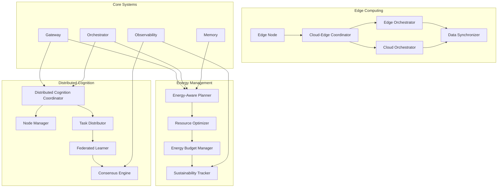

# Infrastructure & System Optimization Specification

## 1. Energy-Aware Planning and Resource Management

### Energy-Aware Planner

**Цель**: Оптимизация использования ресурсов с учетом энергетической эффективности.

#### Energy Cost Modeling

```python
class EnergyAwarePlanner:
    def __init__(self, config: EnergyConfig):
        self.energy_model = EnergyConsumptionModel(config.energy_model)
        self.resource_optimizer = ResourceOptimizer(config.resource_optimization)
        self.energy_budget_manager = EnergyBudgetManager(config.budget)
        self.sustainability_tracker = SustainabilityTracker(config.sustainability)

    async def plan_with_energy_constraints(self, task: Task, constraints: EnergyConstraints) -> EnergyOptimizedPlan:
        # Estimate energy requirements for task
        energy_estimate = await self.energy_model.estimate_task_energy(task)

        # Check energy budget availability
        budget_check = await self.energy_budget_manager.check_budget_availability(
            energy_estimate, constraints.time_window
        )

        if not budget_check.available:
            # Find energy-efficient alternative
            alternative_plan = await self.find_energy_efficient_alternative(task, constraints)
            energy_estimate = alternative_plan.energy_estimate

        # Optimize resource allocation for energy efficiency
        resource_allocation = await self.resource_optimizer.optimize_allocation(
            task, energy_estimate, constraints
        )

        # Create execution schedule considering energy patterns
        schedule = await self.create_energy_aware_schedule(
            resource_allocation, energy_estimate, constraints
        )

        return EnergyOptimizedPlan(
            original_task=task,
            energy_estimate=energy_estimate,
            resource_allocation=resource_allocation,
            execution_schedule=schedule,
            energy_savings=self.calculate_energy_savings(task, schedule),
            sustainability_impact=self.assess_sustainability_impact(schedule)
        )

@dataclass
class EnergyConstraints:
    max_energy_per_hour: float  # kWh
    time_window: TimeWindow
    priority_level: int  # 1-10, higher = more critical
    sustainability_requirements: Dict[str, float]

@dataclass
class EnergyEstimate:
    base_consumption: float  # kWh
    peak_consumption: float  # kW
    duration_hours: float
    energy_efficiency_score: float  # 0-1, higher = more efficient
    carbon_footprint: float  # kg CO2
    renewable_energy_usage: float  # percentage
```

#### Resource Optimization Engine

```python
class ResourceOptimizer:
    def __init__(self, config: ResourceOptimizationConfig):
        self.energy_profiler = EnergyProfiler(config.energy_profiling)
        self.load_balancer = EnergyAwareLoadBalancer(config.load_balancing)
        self.scaling_engine = AutoScalingEngine(config.scaling)
        self.efficiency_analyzer = EfficiencyAnalyzer(config.efficiency_analysis)

    async def optimize_allocation(self, task: Task, energy_estimate: EnergyEstimate, constraints: EnergyConstraints) -> ResourceAllocation:
        # Profile energy consumption patterns
        energy_profile = await self.energy_profiler.profile_task_energy(task)

        # Find optimal resource configuration
        optimal_config = await self.find_optimal_resource_config(
            task, energy_profile, constraints
        )

        # Balance load across available resources
        balanced_allocation = await self.load_balancer.balance_load(
            optimal_config, current_system_load()
        )

        # Set up auto-scaling policies
        scaling_policy = await self.scaling_engine.create_scaling_policy(
            balanced_allocation, energy_profile
        )

        return ResourceAllocation(
            compute_resources=balanced_allocation.compute,
            memory_resources=balanced_allocation.memory,
            storage_resources=balanced_allocation.storage,
            network_resources=balanced_allocation.network,
            scaling_policy=scaling_policy,
            energy_efficiency_score=self.calculate_allocation_efficiency(balanced_allocation),
            cost_estimate=self.estimate_resource_cost(balanced_allocation)
        )

    async def find_optimal_resource_config(self, task: Task, energy_profile: EnergyProfile, constraints: EnergyConstraints) -> ResourceConfig:
        # Multi-objective optimization: performance vs energy vs cost
        candidates = await self.generate_resource_candidates(task, constraints)

        scored_candidates = []
        for candidate in candidates:
            performance_score = await self.evaluate_performance(candidate, task)
            energy_score = await self.evaluate_energy_efficiency(candidate, energy_profile)
            cost_score = await self.evaluate_cost_efficiency(candidate)

            combined_score = self.combine_objectives(
                performance_score, energy_score, cost_score, constraints.priority_level
            )

            scored_candidates.append(ScoredCandidate(
                config=candidate,
                performance_score=performance_score,
                energy_score=energy_score,
                cost_score=cost_score,
                combined_score=combined_score
            ))

        return max(scored_candidates, key=lambda c: c.combined_score).config
```

### Energy Budget Management

```python
class EnergyBudgetManager:
    def __init__(self, config: BudgetConfig):
        self.budget_tracker = BudgetTracker(config.tracking)
        self.forecasting_engine = EnergyForecastingEngine(config.forecasting)
        self.budget_allocator = BudgetAllocator(config.allocation)
        self.sustainability_monitor = SustainabilityMonitor(config.sustainability)

    async def check_budget_availability(self, energy_estimate: EnergyEstimate, time_window: TimeWindow) -> BudgetCheck:
        # Get current budget status
        current_budget = await self.budget_tracker.get_current_budget()

        # Forecast energy usage in time window
        forecasted_usage = await self.forecasting_engine.forecast_usage(time_window)

        # Calculate available budget
        available_budget = current_budget.remaining - forecasted_usage.baseline

        # Check if estimate fits within budget
        fits_budget = energy_estimate.base_consumption <= available_budget

        if not fits_budget:
            # Try budget reallocation
            reallocation_result = await self.budget_allocator.attempt_reallocation(
                energy_estimate, current_budget, time_window
            )

            if reallocation_result.success:
                fits_budget = True
                reallocation_plan = reallocation_result.plan
            else:
                alternative_budget = await self.find_alternative_budget_window(
                    energy_estimate, time_window
                )

        return BudgetCheck(
            available=fits_budget,
            available_budget=available_budget,
            estimated_usage=energy_estimate.base_consumption,
            reallocation_plan=reallocation_plan if 'reallocation_plan' in locals() else None,
            alternative_window=alternative_budget.window if 'alternative_budget' in locals() else None,
            sustainability_notes=self.generate_sustainability_notes(energy_estimate)
        )
```

## 2. Distributed Cognition Architecture

### Distributed Cognition Coordinator

**Цель**: Распределенное мышление между устройствами и агентами для масштабируемого интеллекта.

#### Distributed Computation Framework

```python
class DistributedCognitionCoordinator:
    def __init__(self, config: DistributedConfig):
        self.node_manager = NodeManager(config.node_management)
        self.task_distributor = TaskDistributor(config.task_distribution)
        self.knowledge_sharer = KnowledgeSharer(config.knowledge_sharing)
        self.consensus_engine = ConsensusEngine(config.consensus)
        self.federated_learner = FederatedLearningCoordinator(config.federated_learning)

    async def distribute_cognitive_task(self, task: CognitiveTask) -> DistributedResult:
        # Analyze task requirements
        task_analysis = await self.analyze_task_requirements(task)

        # Select participating nodes
        participating_nodes = await self.node_manager.select_nodes(task_analysis)

        # Distribute task components
        task_distribution = await self.task_distributor.distribute_task(
            task, participating_nodes
        )

        # Execute distributed computation
        execution_results = await self.execute_distributed_computation(task_distribution)

        # Achieve consensus on results
        consensus_result = await self.consensus_engine.achieve_consensus(execution_results)

        # Share learned knowledge
        knowledge_sharing = await self.knowledge_sharer.share_insights(
            consensus_result, participating_nodes
        )

        return DistributedResult(
            task=task,
            participating_nodes=participating_nodes,
            execution_results=execution_results,
            consensus_result=consensus_result,
            knowledge_shared=knowledge_sharing,
            performance_metrics=self.compute_performance_metrics(execution_results),
            scalability_assessment=self.assess_scalability(task_distribution)
        )

@dataclass
class CognitiveTask:
    id: TaskId
    type: str  # "planning", "learning", "reasoning", "perception"
    complexity: float
    data_requirements: Dict[str, Any]
    computational_requirements: Dict[str, Any]
    deadline: datetime
    privacy_requirements: List[str]

@dataclass
class NodeCapabilities:
    compute_power: float  # TFLOPS
    memory_gb: float
    network_bandwidth: float  # Mbps
    energy_efficiency: float
    specialization_domains: List[str]
    trust_score: float
    availability_score: float
```

#### Federated Learning Coordinator

```python
class FederatedLearningCoordinator:
    def __init__(self, config: FederatedConfig):
        self.privacy_preserver = PrivacyPreserver(config.privacy)
        self.model_aggregator = ModelAggregator(config.aggregation)
        self.convergence_tracker = ConvergenceTracker(config.convergence)
        self.federation_manager = FederationManager(config.management)

    async def coordinate_federated_learning(self, learning_task: FederatedLearningTask) -> FederatedResult:
        # Select participating nodes
        participants = await self.federation_manager.select_participants(learning_task)

        # Initialize federated learning round
        round_config = await self.initialize_learning_round(learning_task, participants)

        # Execute federated learning rounds
        learning_rounds = []
        for round_num in range(learning_task.max_rounds):
            round_result = await self.execute_learning_round(round_config, round_num)

            # Check convergence
            convergence_status = await self.convergence_tracker.check_convergence(
                round_result, learning_task.convergence_threshold
            )

            learning_rounds.append(round_result)

            if convergence_status.converged:
                break

        # Final model aggregation
        final_model = await self.model_aggregator.aggregate_final_model(learning_rounds)

        return FederatedResult(
            learning_task=learning_task,
            participants=participants,
            learning_rounds=learning_rounds,
            final_model=final_model,
            convergence_achieved=convergence_status.converged,
            privacy_preserved=self.verify_privacy_preservation(learning_rounds),
            performance_gain=self.compute_performance_gain(final_model, learning_task)
        )

    async def execute_learning_round(self, round_config: RoundConfig, round_num: int) -> LearningRound:
        # Distribute model to participants
        distribution_results = await asyncio.gather(*[
            self.distribute_model_to_participant(round_config.model, participant)
            for participant in round_config.participants
        ])

        # Participants train locally
        local_updates = await asyncio.gather(*[
            self.train_on_participant(participant, round_config.task_config)
            for participant in round_config.participants
        ])

        # Collect updates with privacy preservation
        private_updates = await self.privacy_preserver.process_updates(local_updates)

        # Aggregate updates
        aggregated_update = await self.model_aggregator.aggregate_updates(private_updates)

        # Update global model
        new_global_model = await self.update_global_model(
            round_config.model, aggregated_update
        )

        return LearningRound(
            round_number=round_num,
            participants_trained=len(local_updates),
            model_update=aggregated_update,
            new_global_model=new_global_model,
            privacy_metrics=self.compute_privacy_metrics(private_updates),
            communication_cost=self.compute_communication_cost(distribution_results, local_updates)
        )
```

### Node Management System

```python
class NodeManager:
    def __init__(self, config: NodeManagementConfig):
        self.node_discovery = NodeDiscovery(config.discovery)
        self.capability_assessor = CapabilityAssessor(config.capability_assessment)
        self.load_monitor = LoadMonitor(config.load_monitoring)
        self.health_checker = HealthChecker(config.health_checking)
        self.resource_allocator = ResourceAllocator(config.resource_allocation)

    async def select_nodes(self, task_analysis: TaskAnalysis) -> List[NodeInfo]:
        # Discover available nodes
        available_nodes = await self.node_discovery.discover_nodes()

        # Assess node capabilities
        capability_assessments = await asyncio.gather(*[
            self.capability_assessor.assess_node(node, task_analysis)
            for node in available_nodes
        ])

        # Filter by health and load
        healthy_nodes = await self.filter_healthy_nodes(available_nodes)
        lightly_loaded_nodes = await self.filter_by_load(healthy_nodes)

        # Select optimal subset
        selected_nodes = await self.select_optimal_subset(
            lightly_loaded_nodes, task_analysis, capability_assessments
        )

        return selected_nodes

    async def select_optimal_subset(self, candidates: List[NodeInfo], task_analysis: TaskAnalysis, assessments: List[CapabilityAssessment]) -> List[NodeInfo]:
        # Multi-objective optimization
        optimization_problem = NodeSelectionProblem(
            candidates=candidates,
            task_requirements=task_analysis,
            assessments=assessments,
            objectives=['performance', 'energy_efficiency', 'cost', 'reliability']
        )

        solution = await self.solve_optimization_problem(optimization_problem)

        return solution.selected_nodes
```

## 3. Edge Computing Integration

### Edge Deployment Framework

**Цель**: Интеграция с граничными устройствами для распределенного интеллекта.

#### Edge Node Architecture

```python
class EdgeNode:
    def __init__(self, config: EdgeConfig):
        self.local_processor = LocalInferenceEngine(config.local_inference)
        self.cloud_connector = CloudConnector(config.cloud_connection)
        self.data_manager = EdgeDataManager(config.data_management)
        self.adaptation_engine = EdgeAdaptationEngine(config.adaptation)

    async def process_edge_task(self, task: EdgeTask) -> EdgeResult:
        # Determine processing strategy
        processing_strategy = await self.determine_processing_strategy(task)

        if processing_strategy == 'local':
            result = await self.process_locally(task)
        elif processing_strategy == 'cloud_offload':
            result = await self.offload_to_cloud(task)
        elif processing_strategy == 'hybrid':
            result = await self.process_hybrid(task)
        else:
            result = await self.defer_processing(task)

        # Adapt based on performance
        await self.adaptation_engine.adapt_strategy(
            task, result, processing_strategy
        )

        return result

    async def determine_processing_strategy(self, task: EdgeTask) -> str:
        # Assess local capabilities
        local_capability = await self.assess_local_capability(task)

        # Check connectivity
        connectivity_status = await self.check_connectivity()

        # Evaluate task urgency and constraints
        task_requirements = self.evaluate_task_requirements(task)

        # Make strategy decision
        if local_capability.can_handle and task_requirements.allows_local:
            return 'local'
        elif connectivity_status.available and task_requirements.allows_cloud:
            return 'cloud_offload'
        elif local_capability.partial_support:
            return 'hybrid'
        else:
            return 'defer'

@dataclass
class EdgeTask:
    id: TaskId
    type: str
    data_payload: bytes
    computational_requirements: Dict[str, Any]
    latency_constraints: LatencyConstraints
    privacy_requirements: List[str]
    energy_budget: float
```

#### Cloud-Edge Coordination

```python
class CloudEdgeCoordinator:
    def __init__(self, config: CloudEdgeConfig):
        self.edge_orchestrator = EdgeOrchestrator(config.edge_orchestration)
        self.cloud_orchestrator = CloudOrchestrator(config.cloud_orchestration)
        self.data_synchronizer = DataSynchronizer(config.data_sync)
        self.performance_optimizer = PerformanceOptimizer(config.performance)

    async def coordinate_cloud_edge_computation(self, task: DistributedTask) -> CloudEdgeResult:
        # Split task between cloud and edge
        task_split = await self.split_task_for_cloud_edge(task)

        # Execute edge computations
        edge_results = await self.edge_orchestrator.execute_edge_tasks(task_split.edge_tasks)

        # Execute cloud computations
        cloud_results = await self.cloud_orchestrator.execute_cloud_tasks(task_split.cloud_tasks)

        # Synchronize results
        synchronized_results = await self.data_synchronizer.synchronize_results(
            edge_results, cloud_results
        )

        # Optimize for future tasks
        optimization_insights = await self.performance_optimizer.analyze_performance(
            task_split, edge_results, cloud_results
        )

        return CloudEdgeResult(
            task=task,
            edge_results=edge_results,
            cloud_results=cloud_results,
            synchronized_results=synchronized_results,
            optimization_insights=optimization_insights,
            cost_savings=self.calculate_cost_savings(task_split),
            latency_achieved=self.calculate_latency_achieved(edge_results, cloud_results)
        )
```

## Integration Architecture

### Infrastructure Communication Flow



### API Specifications

#### Energy Management API

```yaml
paths:
  /infrastructure/energy/plan:
    post:
      summary: Планирование с учетом энергопотребления
      requestBody:
        content:
          application/json:
            schema:
              type: object
              properties:
                task:
                  $ref: '#/components/schemas/Task'
                constraints:
                  $ref: '#/components/schemas/EnergyConstraints'
      responses:
        '200':
          content:
            application/json:
              schema:
                $ref: '#/components/schemas/EnergyOptimizedPlan'

  /infrastructure/energy/budget:
    get:
      summary: Проверка доступного бюджета энергии
      parameters:
        - name: time_window_hours
          in: query
          schema:
            type: integer
            default: 24
      responses:
        '200':
          content:
            application/json:
              schema:
                $ref: '#/components/schemas/BudgetStatus'

  /infrastructure/energy/optimize:
    post:
      summary: Оптимизация распределения ресурсов
      requestBody:
        content:
          application/json:
            schema:
              type: object
              properties:
                current_allocation:
                  $ref: '#/components/schemas/ResourceAllocation'
                optimization_goals:
                  type: array
                  items:
                    type: string
      responses:
        '200':
          content:
            application/json:
              schema:
                $ref: '#/components/schemas/OptimizedAllocation'
```

#### Distributed Cognition API

```yaml
paths:
  /infrastructure/distributed/process:
    post:
      summary: Распределенная обработка задачи
      requestBody:
        content:
          application/json:
            schema:
              $ref: '#/components/schemas/CognitiveTask'
      responses:
        '200':
          content:
            application/json:
              schema:
                $ref: '#/components/schemas/DistributedResult'

  /infrastructure/distributed/nodes:
    get:
      summary: Получение списка доступных узлов
      responses:
        '200':
          content:
            application/json:
              schema:
                type: array
                items:
                  $ref: '#/components/schemas/NodeInfo'

  /infrastructure/distributed/learn:
    post:
      summary: Федеративное обучение
      requestBody:
        content:
          application/json:
            schema:
              $ref: '#/components/schemas/FederatedLearningTask'
      responses:
        '200':
          content:
            application/json:
              schema:
                $ref: '#/components/schemas/FederatedResult'
```

#### Edge Computing API

```yaml
paths:
  /infrastructure/edge/process:
    post:
      summary: Обработка на граничном устройстве
      requestBody:
        content:
          application/json:
            schema:
              $ref: '#/components/schemas/EdgeTask'
      responses:
        '200':
          content:
            application/json:
              schema:
                $ref: '#/components/schemas/EdgeResult'

  /infrastructure/edge/cloud-coordinate:
    post:
      summary: Координация cloud-edge вычислений
      requestBody:
        content:
          application/json:
            schema:
              $ref: '#/components/schemas/DistributedTask'
      responses:
        '200':
          content:
            application/json:
              schema:
                $ref: '#/components/schemas/CloudEdgeResult'

  /infrastructure/edge/adapt:
    post:
      summary: Адаптация стратегии обработки
      requestBody:
        content:
          application/json:
            schema:
              type: object
              properties:
                task:
                  $ref: '#/components/schemas/EdgeTask'
                performance_feedback:
                  $ref: '#/components/schemas/PerformanceFeedback'
      responses:
        '200':
          content:
            application/json:
              schema:
                $ref: '#/components/schemas/AdaptationResult'
```

## Performance & Scalability

### Infrastructure Metrics

- **Energy Efficiency**: kWh per task, carbon footprint reduction
- **Distributed Performance**: Latency across nodes, consensus time
- **Edge Efficiency**: Local processing ratio, cloud offload optimization
- **Resource Utilization**: CPU/GPU/memory utilization rates

### Scalability Features

- **Horizontal Scaling**: Automatic node addition/removal
- **Load Balancing**: Intelligent task distribution
- **Fault Tolerance**: Automatic failover and recovery
- **Resource Pooling**: Shared resource management

### Monitoring & Optimization

- **Real-time Dashboards**: Infrastructure health monitoring
- **Predictive Scaling**: Anticipatory resource allocation
- **Performance Profiling**: Bottleneck identification and resolution
- **Cost Optimization**: Dynamic resource cost management
