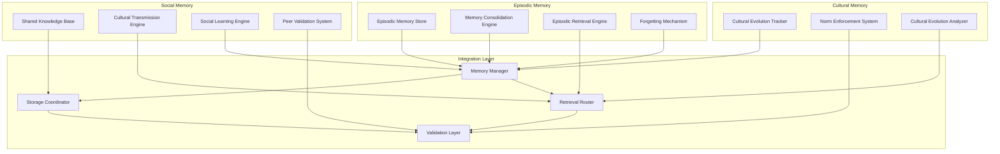

# Advanced Memory Systems Specification

## 1. Episodic Memory Architecture

### Autobiographical Memory System

**Цель**: Хранение и извлечение личного опыта системы для обучения на собственном прошлом.

#### Episodic Store Implementation

```python
class EpisodicMemoryStore:
    def __init__(self, config: EpisodicConfig):
        self.vector_store = QdrantVectorStore(config.vector_store)
        self.metadata_store = SQLiteMetadataStore(config.metadata)
        self.consolidation_engine = MemoryConsolidationEngine(config.consolidation)
        self.retrieval_engine = EpisodicRetrievalEngine(config.retrieval)
        self.forgetting_mechanism = ForgettingMechanism(config.forgetting)

    async def store_episode(self, episode: Episode) -> EpisodeId:
        # Extract features for vector storage
        episode_features = await self.extract_episode_features(episode)

        # Store in vector database
        vector_id = await self.vector_store.store_episode(episode_features)

        # Store metadata in relational database
        metadata_id = await self.metadata_store.store_episode_metadata(episode, vector_id)

        # Trigger consolidation process
        await self.consolidation_engine.consolidate_episode(episode, vector_id)

        return EpisodeId(vector_id=vector_id, metadata_id=metadata_id)

    async def retrieve_similar_episodes(self, query: EpisodeQuery, limit: int = 10) -> List[Episode]:
        # Vector similarity search
        similar_vectors = await self.vector_store.find_similar_episodes(
            query.features, limit=limit * 2  # Over-fetch for filtering
        )

        # Metadata filtering
        filtered_episodes = await self.metadata_store.filter_episodes_by_metadata(
            similar_vectors, query.filters
        )

        # Temporal relevance scoring
        scored_episodes = await self.score_temporal_relevance(filtered_episodes, query.context)

        # Apply forgetting mechanism
        relevant_episodes = await self.forgetting_mechanism.filter_forgotten_episodes(scored_episodes)

        return relevant_episodes[:limit]

@dataclass
class Episode:
    id: EpisodeId
    timestamp: datetime
    context: EpisodeContext
    action_taken: Action
    outcome: Outcome
    lessons_learned: List[Lesson]
    emotional_valence: float  # -1 to 1
    importance_score: float  # 0 to 1
    tags: List[str]

@dataclass
class EpisodeContext:
    situation_description: str
    environmental_factors: Dict[str, Any]
    internal_state: Dict[str, Any]
    stakeholder_involvement: List[str]
    risk_level: str
```

#### Memory Consolidation Engine

```python
class MemoryConsolidationEngine:
    def __init__(self, config: ConsolidationConfig):
        self.consolidation_threshold = config.threshold
        self.consolidation_window = config.window_hours
        self.similarity_threshold = config.similarity_threshold
        self.importance_weigher = ImportanceWeigher(config.importance)

    async def consolidate_episode(self, episode: Episode, vector_id: str) -> ConsolidationResult:
        # Find related episodes within consolidation window
        related_episodes = await self.find_related_episodes(episode, self.consolidation_window)

        if len(related_episodes) < self.consolidation_threshold:
            return ConsolidationResult(
                consolidated=False,
                reason="insufficient_related_episodes",
                consolidation_group=None
            )

        # Create consolidation group
        consolidation_group = await self.create_consolidation_group(
            [episode] + related_episodes
        )

        # Update importance scores
        updated_importance = await self.importance_weigher.reweigh_importance(
            consolidation_group
        )

        # Merge similar memories
        merged_episode = await self.merge_similar_episodes(consolidation_group)

        return ConsolidationResult(
            consolidated=True,
            consolidation_group=consolidation_group,
            merged_episode=merged_episode,
            importance_updates=updated_importance
        )

    async def merge_similar_episodes(self, episodes: List[Episode]) -> Episode:
        # Compute weighted average of features
        merged_context = self.compute_weighted_context(episodes)
        merged_outcome = self.compute_weighted_outcome(episodes)
        merged_lessons = self.consolidate_lessons(episodes)

        # Create consolidated episode
        return Episode(
            id=EpisodeId.consolidated(episodes),
            timestamp=max(e.timestamp for e in episodes),  # Most recent
            context=merged_context,
            action_taken=self.select_representative_action(episodes),
            outcome=merged_outcome,
            lessons_learned=merged_lessons,
            emotional_valence=self.compute_average_valence(episodes),
            importance_score=max(e.importance_score for e in episodes),  # Highest importance
            tags=self.consolidate_tags(episodes)
        )
```

#### Episodic Retrieval Engine

```python
class EpisodicRetrievalEngine:
    def __init__(self, config: RetrievalConfig):
        self.similarity_scorer = SimilarityScorer(config.similarity)
        self.context_matcher = ContextMatcher(config.context)
        self.temporal_weigher = TemporalWeigher(config.temporal)
        self.relevance_ranker = RelevanceRanker(config.relevance)

    async def retrieve_relevant_episodes(self, query: EpisodeQuery) -> List[RetrievedEpisode]:
        # Multi-faceted retrieval
        candidates = await asyncio.gather(
            self.retrieve_by_similarity(query),
            self.retrieve_by_context(query),
            self.retrieve_by_temporal_pattern(query),
            self.retrieve_by_outcome_pattern(query)
        )

        # Combine and deduplicate candidates
        all_candidates = self.combine_candidates(candidates)

        # Rank by relevance
        ranked_episodes = await self.relevance_ranker.rank_episodes(
            all_candidates, query
        )

        # Apply recency and importance boosting
        boosted_episodes = await self.apply_retrieval_boosts(ranked_episodes, query)

        return boosted_episodes

    async def retrieve_by_similarity(self, query: EpisodeQuery) -> List[Episode]:
        # Vector similarity search
        similar_episodes = await self.vector_store.similarity_search(
            query.features,
            limit=query.max_results * 2
        )
        return similar_episodes

    async def retrieve_by_context(self, query: EpisodeQuery) -> List[Episode]:
        # Context-based retrieval
        context_matches = await self.context_matcher.find_context_matches(
            query.context_description,
            query.context_features
        )
        return context_matches

    async def retrieve_by_temporal_pattern(self, query: EpisodeQuery) -> List[Episode]:
        # Temporal pattern matching
        temporal_matches = await self.temporal_weigher.find_temporal_patterns(
            query.time_window,
            query.temporal_features
        )
        return temporal_matches

    async def retrieve_by_outcome_pattern(self, query: EpisodeQuery) -> List[Episode]:
        # Outcome pattern matching
        outcome_matches = await self.find_similar_outcomes(
            query.desired_outcome,
            query.outcome_features
        )
        return outcome_matches
```

### Forgetting Mechanism

```python
class ForgettingMechanism:
    def __init__(self, config: ForgettingConfig):
        self.decay_function = self.select_decay_function(config.decay_type)
        self.importance_threshold = config.importance_threshold
        self.recency_weight = config.recency_weight
        self.consolidation_boost = config.consolidation_boost

    async def apply_forgetting(self, episodes: List[Episode]) -> List[Episode]:
        # Apply time-based decay
        decayed_episodes = []
        current_time = datetime.now()

        for episode in episodes:
            decay_factor = self.compute_decay_factor(episode, current_time)

            # Apply forgetting based on decay and importance
            if decay_factor * episode.importance_score > self.importance_threshold:
                # Episode survives forgetting
                decayed_episodes.append(episode)
            else:
                # Mark for removal or archival
                await self.archive_episode(episode)

        return decayed_episodes

    def compute_decay_factor(self, episode: Episode, current_time: datetime) -> float:
        time_diff = (current_time - episode.timestamp).total_seconds()
        decay_factor = self.decay_function(time_diff)

        # Boost consolidated memories
        if episode.consolidated:
            decay_factor *= self.consolidation_boost

        # Boost recent high-importance memories
        recency_factor = 1.0 / (1.0 + time_diff / self.recency_weight)
        importance_boost = episode.importance_score

        return decay_factor * (1.0 + recency_factor * importance_boost)
```

## 2. Social and Cultural Memory Systems

### Shared Knowledge Base

**Цель**: Коллективная память агентов для передачи знаний и опыта между ними.

#### Social Memory Architecture

```python
class SocialMemorySystem:
    def __init__(self, config: SocialMemoryConfig):
        self.shared_knowledge_base = SharedKnowledgeBase(config.knowledge_base)
        self.cultural_transmission = CulturalTransmissionEngine(config.transmission)
        self.social_learning = SocialLearningEngine(config.social_learning)
        self.peer_validation = PeerValidationSystem(config.validation)

    async def share_knowledge(self, knowledge: KnowledgeItem, from_agent: AgentId, to_agents: List[AgentId]) -> SharingResult:
        # Validate knowledge before sharing
        validation_result = await self.peer_validation.validate_knowledge(knowledge, from_agent)

        if not validation_result.validated:
            return SharingResult(
                shared=False,
                reason=validation_result.rejection_reason,
                validation_feedback=validation_result.feedback
            )

        # Store in shared knowledge base
        knowledge_id = await self.shared_knowledge_base.store_knowledge(knowledge, from_agent)

        # Transmit to target agents
        transmission_results = await asyncio.gather(*[
            self.transmit_knowledge(knowledge_id, to_agent)
            for to_agent in to_agents
        ])

        # Update social connections
        await self.update_social_graph(from_agent, to_agents, knowledge_id)

        return SharingResult(
            shared=True,
            knowledge_id=knowledge_id,
            transmission_results=transmission_results,
            social_impact=self.compute_social_impact(from_agent, to_agents)
        )

@dataclass
class KnowledgeItem:
    id: KnowledgeId
    type: str  # "skill", "strategy", "experience", "cultural_norm"
    content: Dict[str, Any]
    metadata: KnowledgeMetadata
    provenance: ProvenanceChain
    validation_history: List[ValidationRecord]

@dataclass
class KnowledgeMetadata:
    domain: str
    difficulty_level: float
    usefulness_score: float
    creation_timestamp: datetime
    last_accessed: datetime
    access_count: int
    quality_score: float
```

#### Cultural Transmission Engine

```python
class CulturalTransmissionEngine:
    def __init__(self, config: TransmissionConfig):
        self.transmission_channels = TransmissionChannelRegistry(config.channels)
        self.cultural_evolution = CulturalEvolutionTracker(config.evolution)
        self.norm_enforcement = NormEnforcementSystem(config.norms)

    async def transmit_cultural_element(self, element: CulturalElement, from_agent: AgentId, to_agent: AgentId) -> TransmissionResult:
        # Select appropriate transmission channel
        channel = await self.transmission_channels.select_channel(element, from_agent, to_agent)

        # Transmit through channel
        transmission_result = await channel.transmit(element, from_agent, to_agent)

        # Track cultural evolution
        await self.cultural_evolution.track_transmission(
            element, transmission_result, from_agent, to_agent
        )

        # Enforce cultural norms
        norm_compliance = await self.norm_enforcement.check_compliance(
            element, transmission_result
        )

        return TransmissionResult(
            transmitted=transmission_result.success,
            channel_used=channel.name,
            fidelity_score=transmission_result.fidelity,
            cultural_impact=self.compute_cultural_impact(element),
            norm_compliance=norm_compliance
        )

@dataclass
class CulturalElement:
    id: CulturalElementId
    type: str  # "value", "practice", "belief", "tradition"
    content: Dict[str, Any]
    importance_level: float
    stability_score: float  # How resistant to change
    transmission_history: List[TransmissionRecord]
```

### Social Learning Engine

```python
class SocialLearningEngine:
    def __init__(self, config: SocialLearningConfig):
        self.observation_learning = ObservationLearning(config.observation)
        self.imitation_learning = ImitationLearning(config.imitation)
        self.collaborative_learning = CollaborativeLearning(config.collaboration)
        self.peer_teaching = PeerTeachingSystem(config.teaching)

    async def learn_from_others(self, learner: AgentId, teachers: List[AgentId], domain: str) -> LearningResult:
        # Observe teacher behaviors
        observations = await asyncio.gather(*[
            self.observe_agent_behavior(teacher, domain)
            for teacher in teachers
        ])

        # Extract learnable patterns
        patterns = await self.extract_learning_patterns(observations, domain)

        # Apply learning mechanisms
        learning_results = await asyncio.gather(*[
            self.apply_learning_mechanism(learner, pattern, mechanism_type)
            for pattern in patterns
            for mechanism_type in ['observation', 'imitation', 'collaboration']
        ])

        # Validate learning outcomes
        validation_results = await self.validate_learning_outcomes(
            learner, learning_results, domain
        )

        return LearningResult(
            learner=learner,
            patterns_learned=len(patterns),
            mechanisms_applied=learning_results,
            validation_results=validation_results,
            knowledge_gain=self.compute_knowledge_gain(learning_results),
            social_bonds_strengthened=self.compute_social_impact(learner, teachers)
        )

    async def observe_agent_behavior(self, agent: AgentId, domain: str) -> BehaviorObservation:
        # Get agent's recent actions and decisions
        recent_history = await self.get_agent_history(agent, domain, hours=24)

        # Analyze behavior patterns
        patterns = await self.analyze_behavior_patterns(recent_history)

        # Extract successful strategies
        successful_strategies = await self.extract_successful_strategies(patterns)

        return BehaviorObservation(
            agent=agent,
            domain=domain,
            observed_patterns=patterns,
            successful_strategies=successful_strategies,
            observation_quality=self.assess_observation_quality(recent_history)
        )
```

## 3. Cultural Memory Integration

### Cultural Evolution Tracker

```python
class CulturalEvolutionTracker:
    def __init__(self, config: EvolutionConfig):
        self.evolution_metrics = EvolutionMetricsTracker(config.metrics)
        self.selection_pressure = SelectionPressureAnalyzer(config.selection)
        self.drift_detector = CulturalDriftDetector(config.drift)

    async def track_cultural_evolution(self, time_window: timedelta) -> EvolutionReport:
        # Analyze cultural changes over time
        cultural_changes = await self.analyze_cultural_changes(time_window)

        # Compute evolution metrics
        evolution_metrics = await self.evolution_metrics.compute_metrics(cultural_changes)

        # Detect selection pressures
        selection_pressures = await self.selection_pressure.analyze_pressures(cultural_changes)

        # Detect cultural drift
        drift_events = await self.drift_detector.detect_drift(cultural_changes)

        return EvolutionReport(
            time_window=time_window,
            cultural_changes=cultural_changes,
            evolution_metrics=evolution_metrics,
            selection_pressures=selection_pressures,
            drift_events=drift_events,
            evolution_rate=self.compute_evolution_rate(cultural_changes),
            stability_assessment=self.assess_cultural_stability(evolution_metrics)
        )
```

## Integration Architecture

### Memory System Communication



### API Specifications

#### Episodic Memory API

```yaml
paths:
  /memory/episodic/store:
    post:
      summary: Сохранение эпизода
      requestBody:
        content:
          application/json:
            schema:
              $ref: '#/components/schemas/Episode'
      responses:
        '201':
          content:
            application/json:
              schema:
                $ref: '#/components/schemas/EpisodeId'

  /memory/episodic/retrieve:
    post:
      summary: Извлечение похожих эпизодов
      requestBody:
        content:
          application/json:
            schema:
              type: object
              properties:
                query:
                  $ref: '#/components/schemas/EpisodeQuery'
                limit:
                  type: integer
                  default: 10
      responses:
        '200':
          content:
            application/json:
              schema:
                type: array
                items:
                  $ref: '#/components/schemas/Episode'

  /memory/episodic/consolidate:
    post:
      summary: Консолидация памяти
      responses:
        '200':
          content:
            application/json:
              schema:
                $ref: '#/components/schemas/ConsolidationResult'
```

#### Social Memory API

```yaml
paths:
  /memory/social/share:
    post:
      summary: Поделиться знанием
      requestBody:
        content:
          application/json:
            schema:
              type: object
              properties:
                knowledge:
                  $ref: '#/components/schemas/KnowledgeItem'
                from_agent:
                  type: string
                to_agents:
                  type: array
                  items:
                    type: string
      responses:
        '200':
          content:
            application/json:
              schema:
                $ref: '#/components/schemas/SharingResult'

  /memory/social/learn:
    post:
      summary: Социальное обучение
      requestBody:
        content:
          application/json:
            schema:
              type: object
              properties:
                learner:
                  type: string
                teachers:
                  type: array
                  items:
                    type: string
                domain:
                  type: string
      responses:
        '200':
          content:
            application/json:
              schema:
                $ref: '#/components/schemas/LearningResult'

  /memory/social/validate:
    post:
      summary: Валидация знания
      requestBody:
        content:
          application/json:
            schema:
              $ref: '#/components/schemas/KnowledgeItem'
      responses:
        '200':
          content:
            application/json:
              schema:
                $ref: '#/components/schemas/ValidationResult'
```

#### Cultural Memory API

```yaml
paths:
  /memory/cultural/transmit:
    post:
      summary: Передача культурного элемента
      requestBody:
        content:
          application/json:
            schema:
              type: object
              properties:
                element:
                  $ref: '#/components/schemas/CulturalElement'
                from_agent:
                  type: string
                to_agent:
                  type: string
      responses:
        '200':
          content:
            application/json:
              schema:
                $ref: '#/components/schemas/TransmissionResult'

  /memory/cultural/evolution:
    get:
      summary: Отчет об эволюции культуры
      parameters:
        - name: time_window_hours
          in: query
          schema:
            type: integer
            default: 24
      responses:
        '200':
          content:
            application/json:
              schema:
                $ref: '#/components/schemas/EvolutionReport'
```

## Performance & Scalability

### Memory Metrics

- **Storage Efficiency**: Compression ratio, deduplication rate
- **Retrieval Speed**: Average query latency, cache hit rate
- **Consolidation Effectiveness**: Memory compression ratio, forgetting accuracy
- **Social Learning Rate**: Knowledge transmission success rate, learning velocity

### Scalability Features

- **Distributed Storage**: Sharding across multiple nodes
- **Memory Pooling**: Shared memory resources between agents
- **Hierarchical Indexing**: Multi-level retrieval optimization
- **Federated Learning**: Privacy-preserving knowledge sharing

### Monitoring & Maintenance

- **Memory Health Checks**: Corruption detection, consistency validation
- **Performance Profiling**: Bottleneck identification, optimization opportunities
- **Capacity Planning**: Usage forecasting, scaling recommendations
- **Backup & Recovery**: Automated backups, disaster recovery procedures
