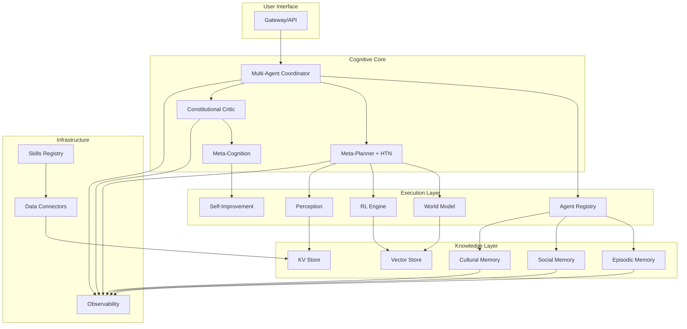

# AGI Platform Architecture Overview

## Цель и Обзор

Полная спецификация архитектуры AGI-платформы на базе PrometheusULTIMATE v4. Платформа эволюционирует от простой agent orchestration системы к полноценной AGI экосистеме с 14 production-ready компонентами.

## Архитектурные Принципы

### 1. **Модульность и Масштабируемость**
- Каждый компонент - независимый микросервис
- Горизонтальное масштабирование для всех сервисов
- Plug-and-play архитектура для добавления новых агентов

### 2. **Безопасность First**
- Zero-trust модель между сервисами
- Sandbox изоляция для всех вычислений
- Constitutional AI с автоматическими safeguards

### 3. **Производительность и Эффективность**
- Оптимизация под NVIDIA H200 (141GB HBM3)
- Energy-aware планирование и распределение ресурсов
- Distributed cognition для swarm intelligence

### 4. **Наблюдаемость и Explainability**
- Полный трейсинг всех решений и действий
- Counterfactual reasoning для анализа "что если"
- Human-in-the-loop интерфейсы для oversight

## Интеграция с Текущей Архитектурой

### Расширение Существующих Компонентов

**Gateway (apps/gateway/)**
- Добавление AGI endpoints для multi-agent координации
- Расширение API для world model запросов
- Интеграция с meta-cognition сервисами

**Orchestrator (apps/orchestrator/)**
- Преобразование в Multi-Agent Coordinator
- Добавление negotiation protocols
- Интеграция с dynamic team formation

**Planner (apps/planner/)**
- Добавление Meta-Planner уровня
- HTN Engine для hierarchical task decomposition
- Temporal reasoning для последовательностей

**Critic (apps/critic/)**
- Расширение до Constitutional Critic
- Value alignment система
- Automatic safeguards и emergency stops

**Memory Service (libs/memory/)**
- Добавление Episodic Memory слоя
- Social/Cultural memory для collective knowledge
- Memory consolidation механизмы

**Observability (libs/observability/)**
- Decision tracing для explainability
- Counterfactual analysis для reasoning
- Uncertainty quantification для confidence

### Новые Микросервисы

1. **Agent Registry (apps/agent_registry/)**
   - Управление жизненным циклом агентов
   - Capability matching и discovery
   - Agent health monitoring

2. **World Model (apps/world_model/)**
   - Предсказательное моделирование окружения
   - Simulation engine для мысленных экспериментов
   - Causal reasoning для понимания последствий

3. **RL Engine (apps/rl_engine/)**
   - Обучение на собственном опыте
   - Meta-learning для быстрой адаптации
   - Curriculum learning для постепенного усложнения

4. **Perception (apps/perception/)**
   - Multimodal processing (video/audio/sensors)
   - Cross-modal reasoning и fusion
   - Embodiment interfaces для физического мира

5. **Meta-Cognition (apps/meta_cognition/)**
   - Self-assessment и confidence estimation
   - Error detection и correction
   - Strategy selection под задачу

6. **Self-Improvement (apps/self_improvement/)**
   - Code generation и testing
   - Architecture optimization
   - Continuous performance monitoring

## Общие Библиотеки

**libs/agents/** - SDK для создания агентов
**libs/world_modeling/** - Инструменты предсказательного моделирования
**libs/learning/** - RL и meta-learning алгоритмы
**libs/safety/** - Безопасность и constitutional AI
**libs/perception/** - Multimodal processing utilities

## Схема Взаимодействия Компонентов



## Data Flow Architecture

### Основные Потоки Данных

1. **Task Processing Flow**
   ```
   User Request → Gateway → Multi-Agent Coordinator → Meta-Planner
   → Agent Selection → World Model Simulation → Execution
   → Constitutional Critic Review → Meta-Cognition Assessment
   → Memory Storage → Observability Logging
   ```

2. **Learning Flow**
   ```
   Experience → Episodic Memory → RL Engine Training
   → Meta-Learning Adaptation → Self-Improvement Code Generation
   → Architecture Optimization → Performance Monitoring
   ```

3. **Perception Flow**
   ```
   Multimodal Input → Perception Pipeline → Cross-Modal Fusion
   → World Model Update → Causal Reasoning → Action Planning
   ```

## API Контракты

### Core AGI API (Gateway Extensions)

```yaml
openapi: 3.0.0
info:
  title: AGI Platform API
  version: 1.0.0

paths:
  /agi/task:
    post:
      summary: Создание AGI задачи
      requestBody:
        required: true
        content:
          application/json:
            schema:
              type: object
              properties:
                goal:
                  type: string
                  description: Цель задачи
                constraints:
                  type: object
                  description: Ограничения и лимиты
                agent_types:
                  type: array
                  items:
                    type: string
                  description: Требуемые типы агентов
                world_context:
                  type: object
                  description: Контекст окружения

  /agi/agents:
    get:
      summary: Получение списка активных агентов
    post:
      summary: Регистрация нового агента

  /agi/world/simulate:
    post:
      summary: Запуск симуляции в world model

  /agi/learn:
    post:
      summary: Запуск цикла обучения

  /agi/reflect:
    post:
      summary: Запрос мета-познания на задачу

  /agi/improve:
    post:
      summary: Запуск цикла самоулучшения
```

## Требования к H200 Развертыванию

### Hardware Specifications
- **GPU**: NVIDIA H200 (141GB HBM3)
- **CUDA**: 12.x compatible
- **Memory**: 512GB+ system RAM
- **Storage**: NVMe SSD 4TB+ для моделей и данных

### Performance Optimization
- **Mixed Precision**: FP16/BF16 для inference
- **Gradient Checkpointing**: Для memory-efficient training
- **Multi-GPU**: Distributed training для крупных моделей
- **GPU Memory Management**: Automatic offloading

### Monitoring
- **DCGM**: GPU utilization и health monitoring
- **NVIDIA Data Center GPU Manager**: Resource allocation
- **Custom Metrics**: AGI-specific performance indicators

## Безопасность и Compliance

### Zero-Trust Architecture
- mTLS между всеми сервисами
- Service mesh (Istio/Linkerd)
- API authentication и authorization
- Audit logging всех действий

### Constitutional AI Safeguards
- Automatic emergency stops при обнаружении рисков
- Value alignment verification для всех решений
- PII detection и redaction
- Adversarial input detection

### Resource Limits
- CPU/RAM limits per agent
- GPU memory quotas
- Network bandwidth controls
- Execution time limits

## Deployment Strategy

### Phase 1: Core AGI (Months 1-2)
- Multi-Agent Coordinator + Agent Registry
- HTN Planner + Meta-Planner
- Basic World Model + Causal Reasoning

### Phase 2: Learning & Adaptation (Months 3-4)
- RL Engine + Meta-Learning
- Episodic Memory + Memory Consolidation
- Curriculum Learning system

### Phase 3: Self-Awareness (Months 5-6)
- Meta-Cognition + Self-Assessment
- Constitutional Critic + Safeguards
- Error Detection & Correction

### Phase 4: Full AGI (Months 7-8)
- Self-Improvement loops
- Perception Pipeline + Embodiment
- Distributed Cognition
- H200 optimization и production deployment

## Success Criteria

### Functional Requirements
- ✅ Автономное решение открытых задач
- ✅ Обучение на собственном опыте
- ✅ Адаптация к новым доменам без retraining
- ✅ Реал-тайм взаимодействие с физическим миром
- ✅ Поддержка coherent identity через время
- ✅ Curiosity-driven exploration behavior

### Performance Requirements
- ⏱️ Task completion: < 10s для типовых задач
- 🧠 Memory efficiency: < 50GB GPU memory per agent
- 🔄 Learning speed: Adaptation в течение минут/часов
- 🛡️ Safety: Zero critical failures в production
- 📊 Observability: 100% decision traceability

### Scalability Requirements
- 📈 Horizontal scaling: 100+ concurrent agents
- 🌐 Distributed cognition: Multi-node deployment
- ⚡ Energy efficiency: < 500W per agent average
- 🔧 Self-healing: Automatic recovery от failures
