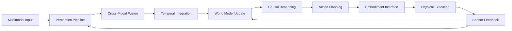

# Perception & Multimodal Processing Specification

## 1. Multimodal Perception Pipeline

### Core Architecture

**Цель**: Обработка и интеграция мультимодальных данных (видео, аудио, сенсоры) для создания богатого представления окружающего мира.

#### Perception Pipeline Architecture

```python
class MultimodalPerceptionPipeline:
    def __init__(self, config: PerceptionConfig):
        self.modalities = {
            'vision': VisionProcessor(config.vision),
            'audio': AudioProcessor(config.audio),
            'tactile': TactileProcessor(config.tactile),
            'proprioception': ProprioceptionProcessor(config.proprioception),
            'lidar': LidarProcessor(config.lidar),
            'imu': IMUProcessor(config.imu)
        }
        self.fusion_engine = CrossModalFusionEngine(config.fusion)
        self.attention_mechanism = MultimodalAttention(config.attention)
        self.temporal_integrator = TemporalIntegrator(config.temporal)

    async def process_multimodal_input(self, inputs: Dict[str, SensorData]) -> PerceptionResult:
        # Parallel processing of each modality
        modality_features = await asyncio.gather(*[
            self.modalities[modality].process(data)
            for modality, data in inputs.items()
        ])

        # Cross-modal fusion
        fused_features = await self.fusion_engine.fuse_features(modality_features)

        # Temporal integration for sequence understanding
        temporal_context = await self.temporal_integrator.integrate(
            fused_features, self.previous_states
        )

        # Attention-based selection of relevant information
        attended_features = await self.attention_mechanism.attend(temporal_context)

        return PerceptionResult(
            raw_features=modality_features,
            fused_features=fused_features,
            temporal_context=temporal_context,
            attended_features=attended_features,
            confidence_scores=self.compute_confidence_scores(attended_features),
            uncertainty_map=self.compute_uncertainty_map(attended_features)
        )

@dataclass
class PerceptionConfig:
    vision: VisionConfig
    audio: AudioConfig
    tactile: TactileConfig
    proprioception: ProprioceptionConfig
    lidar: LidarConfig
    imu: IMUConfig
    fusion: FusionConfig
    attention: AttentionConfig
    temporal: TemporalConfig
```

#### Vision Processor

```python
class VisionProcessor:
    def __init__(self, config: VisionConfig):
        self.backbone = self.load_backbone(config.backbone_type)
        self.object_detector = ObjectDetector(config.detection)
        self.scene_understanding = SceneUnderstanding(config.scene)
        self.action_recognition = ActionRecognition(config.action)
        self.emotion_detector = EmotionDetector(config.emotion)

    async def process(self, visual_data: VisualData) -> VisionFeatures:
        # Multi-scale feature extraction
        features = await self.backbone.extract_features(visual_data.frames)

        # Parallel analysis tasks
        detection_results = await self.object_detector.detect_objects(features)
        scene_description = await self.scene_understanding.describe_scene(features)
        actions_detected = await self.action_recognition.recognize_actions(
            features, visual_data.temporal_sequence
        )
        emotions_detected = await self.emotion_detector.detect_emotions(
            features, detection_results.faces
        )

        return VisionFeatures(
            features=features,
            objects=detection_results,
            scene=scene_description,
            actions=actions_detected,
            emotions=emotions_detected,
            spatial_attention_map=self.compute_attention_map(features)
        )

@dataclass
class VisionConfig:
    backbone_type: str = "efficientnet_b7"
    detection: DetectionConfig
    scene: SceneConfig
    action: ActionConfig
    emotion: EmotionConfig
    temporal_window: int = 32  # frames
    fps: int = 30
```

#### Audio Processor

```python
class AudioProcessor:
    def __init__(self, config: AudioConfig):
        self.speech_recognizer = SpeechRecognizer(config.speech)
        self.sound_classifier = SoundClassifier(config.sound)
        self.emotion_analyzer = AudioEmotionAnalyzer(config.emotion)
        self.source_separator = SourceSeparator(config.separation)
        self.spatial_audio = SpatialAudioProcessor(config.spatial)

    async def process(self, audio_data: AudioData) -> AudioFeatures:
        # Multi-channel audio processing
        separated_sources = await self.source_separator.separate_sources(audio_data)

        # Parallel analysis
        speech_transcripts = await self.speech_recognizer.transcribe(separated_sources.speech)
        sound_events = await self.sound_classifier.classify_events(separated_sources.environment)
        emotions_audio = await self.emotion_analyzer.analyze_emotions(separated_sources.speech)
        spatial_info = await self.spatial_audio.localize_sources(separated_sources.all)

        return AudioFeatures(
            transcripts=speech_transcripts,
            sound_events=sound_events,
            emotions=emotions_audio,
            spatial_localization=spatial_info,
            separated_sources=separated_sources,
            acoustic_features=self.extract_acoustic_features(audio_data)
        )
```

## 2. Cross-Modal Reasoning Engine

### Feature Fusion Architecture

**Цель**: Интеграция информации из разных модальностей для создания coherent понимания сцены.

#### Fusion Strategies

```python
class CrossModalFusionEngine:
    def __init__(self, config: FusionConfig):
        self.fusion_strategies = {
            'early': EarlyFusion(config.early),
            'late': LateFusion(config.late),
            'hybrid': HybridFusion(config.hybrid),
            'attention': AttentionFusion(config.attention)
        }
        self.modality_aligner = ModalityAligner(config.alignment)
        self.conflict_resolver = ConflictResolver(config.conflict_resolution)

    async def fuse_features(self, modality_features: List[ModalityFeatures]) -> FusedFeatures:
        # Align modalities in common representation space
        aligned_features = await self.modality_aligner.align_modalities(modality_features)

        # Select appropriate fusion strategy based on task and context
        fusion_strategy = self.select_fusion_strategy(modality_features)

        # Apply fusion
        fused_features = await fusion_strategy.fuse(aligned_features)

        # Resolve any conflicts between modalities
        resolved_features = await self.conflict_resolver.resolve_conflicts(fused_features)

        return FusedFeatures(
            fused_representation=fused_features,
            fusion_strategy_used=fusion_strategy.name,
            modality_contributions=self.compute_contributions(modality_features),
            conflict_resolution_log=self.conflict_resolver.get_resolution_log(),
            fusion_confidence=self.compute_fusion_confidence(fused_features)
        )

class AttentionFusion:
    def __init__(self, config: AttentionFusionConfig):
        self.cross_attention = CrossModalAttention(config.cross_attention)
        self.self_attention = SelfAttention(config.self_attention)
        self.fusion_attention = FusionAttention(config.fusion_attention)

    async def fuse(self, aligned_features: Dict[str, torch.Tensor]) -> torch.Tensor:
        # Cross-modal attention between all modality pairs
        cross_attended = {}
        for mod_a, mod_b in combinations(aligned_features.keys(), 2):
            cross_attended[f"{mod_a}_{mod_b}"] = self.cross_attention(
                aligned_features[mod_a], aligned_features[mod_b]
            )

        # Self-attention within each modality
        self_attended = {}
        for modality, features in aligned_features.items():
            self_attended[modality] = self.self_attention(features)

        # Fusion attention to combine everything
        all_features = list(cross_attended.values()) + list(self_attended.values())
        fused = self.fusion_attention(torch.stack(all_features))

        return fused
```

#### Modality Alignment

```python
class ModalityAligner:
    def __init__(self, config: AlignmentConfig):
        self.aligners = {
            'vision_audio': VisionAudioAligner(config.vision_audio),
            'vision_tactile': VisionTactileAligner(config.vision_tactile),
            'audio_proprioception': AudioProprioceptionAligner(config.audio_proprioception)
        }
        self.temporal_aligner = TemporalAligner(config.temporal)
        self.semantic_aligner = SemanticAligner(config.semantic)

    async def align_modalities(self, modality_features: List[ModalityFeatures]) -> Dict[str, torch.Tensor]:
        # Temporal alignment (synchronize timestamps)
        temporally_aligned = await self.temporal_aligner.align_temporal(modality_features)

        # Semantic alignment (common concept space)
        semantically_aligned = await self.semantic_aligner.align_semantic(temporally_aligned)

        # Cross-modal alignment for specific pairs
        cross_aligned = {}
        for pair, aligner in self.aligners.items():
            if pair in semantically_aligned:
                cross_aligned[pair] = await aligner.align_pair(semantically_aligned[pair])

        return {
            **semantically_aligned,
            **cross_aligned
        }
```

### Conflict Resolution

```python
class ConflictResolver:
    def __init__(self, config: ConflictResolutionConfig):
        self.conflict_detector = ConflictDetector(config.detection)
        self.resolution_strategies = {
            'voting': VotingResolution(),
            'weighted': WeightedResolution(),
            'hierarchical': HierarchicalResolution(),
            'neural': NeuralResolution(config.neural)
        }

    async def resolve_conflicts(self, fused_features: FusedFeatures) -> ResolvedFeatures:
        # Detect conflicts between modalities
        conflicts = await self.conflict_detector.detect_conflicts(fused_features)

        if not conflicts:
            return ResolvedFeatures(
                features=fused_features,
                conflicts_resolved=[],
                resolution_log=[]
            )

        # Apply resolution strategies
        resolution_results = []
        resolution_log = []

        for conflict in conflicts:
            strategy = self.select_resolution_strategy(conflict)
            result = await strategy.resolve(conflict, fused_features)
            resolution_results.append(result)

            resolution_log.append({
                'conflict': conflict,
                'strategy': strategy.name,
                'result': result,
                'confidence': result.confidence
            })

        # Merge resolved features
        final_features = self.merge_resolved_features(fused_features, resolution_results)

        return ResolvedFeatures(
            features=final_features,
            conflicts_resolved=resolution_results,
            resolution_log=resolution_log,
            overall_confidence=self.compute_overall_confidence(resolution_results)
        )
```

## 3. Embodiment Interface

### Physical World Integration

**Цель**: Связь с физическими устройствами и реальным миром через actuation и sensing.

#### Robot Embodiment Interface

```python
class EmbodimentInterface:
    def __init__(self, config: EmbodimentConfig):
        self.actuators = ActuatorController(config.actuators)
        self.sensors = SensorController(config.sensors)
        self.state_estimator = StateEstimator(config.state_estimation)
        self.safety_controller = SafetyController(config.safety)
        self.feedback_loop = SensorimotorFeedbackLoop(config.feedback)

    async def execute_action(self, action: PhysicalAction) -> ActionResult:
        # Pre-execution safety check
        safety_clearance = await self.safety_controller.check_safety(action)

        if not safety_clearance.safe:
            return ActionResult(
                success=False,
                error=safety_clearance.reason,
                safety_violation=True
            )

        # Execute action
        execution_result = await self.actuators.execute(action)

        # Monitor execution with sensors
        sensor_feedback = await self.sensors.monitor_execution(action)

        # Update internal state estimation
        updated_state = await self.state_estimator.update_state(
            action, execution_result, sensor_feedback
        )

        # Close feedback loop
        feedback_result = await self.feedback_loop.process_feedback(
            action, execution_result, sensor_feedback
        )

        return ActionResult(
            success=execution_result.success,
            executed_action=action,
            sensor_feedback=sensor_feedback,
            state_update=updated_state,
            feedback_adjustments=feedback_result.adjustments,
            safety_status=safety_clearance
        )

@dataclass
class EmbodimentConfig:
    actuators: ActuatorConfig
    sensors: SensorConfig
    state_estimation: StateEstimationConfig
    safety: SafetyConfig
    feedback: FeedbackConfig
```

#### Actuator Controller

```python
class ActuatorController:
    def __init__(self, config: ActuatorConfig):
        self.motor_controllers = MotorController(config.motors)
        self.gripper_controller = GripperController(config.gripper)
        self.navigation_system = NavigationSystem(config.navigation)
        self.manipulation_planner = ManipulationPlanner(config.manipulation)

    async def execute(self, action: PhysicalAction) -> ExecutionResult:
        if action.type == 'manipulation':
            return await self.execute_manipulation(action)
        elif action.type == 'navigation':
            return await self.execute_navigation(action)
        elif action.type == 'grasping':
            return await self.execute_grasping(action)
        else:
            raise ValueError(f"Unsupported action type: {action.type}")

    async def execute_manipulation(self, action: ManipulationAction) -> ExecutionResult:
        # Plan manipulation trajectory
        trajectory = await self.manipulation_planner.plan_trajectory(
            action.start_pose, action.target_pose, action.constraints
        )

        # Execute trajectory with force control
        execution_result = await self.motor_controllers.execute_trajectory(
            trajectory, action.force_limits
        )

        return ExecutionResult(
            success=execution_result.success,
            actual_trajectory=execution_result.trajectory,
            force_profile=execution_result.force_profile,
            errors=execution_result.errors
        )
```

#### Sensor Integration

```python
class SensorController:
    def __init__(self, config: SensorConfig):
        self.vision_sensors = VisionSensorArray(config.vision)
        self.force_torque_sensors = ForceTorqueSensors(config.force_torque)
        self.proximity_sensors = ProximitySensors(config.proximity)
        self.tactile_sensors = TactileSensors(config.tactile)
        self.imu_sensors = IMUSensors(config.imu)

    async def monitor_execution(self, action: PhysicalAction) -> SensorFeedback:
        # Collect sensor data during action execution
        sensor_readings = await asyncio.gather(
            self.vision_sensors.get_reading(),
            self.force_torque_sensors.get_reading(),
            self.proximity_sensors.get_reading(),
            self.tactile_sensors.get_reading(),
            self.imu_sensors.get_reading()
        )

        # Fuse sensor data
        fused_feedback = await self.fuse_sensor_data(sensor_readings, action)

        return SensorFeedback(
            timestamp=datetime.now(),
            raw_readings=sensor_readings,
            fused_feedback=fused_feedback,
            action_context=action,
            data_quality=self.assess_data_quality(sensor_readings)
        )

    async def fuse_sensor_data(self, readings: List[SensorReading], action: PhysicalAction) -> FusedSensorData:
        # Multi-sensor fusion for robust state estimation
        # Handle sensor failures and outliers
        # Provide unified feedback interface
        pass
```

#### Safety Controller

```python
class SafetyController:
    def __init__(self, config: SafetyConfig):
        self.collision_detector = CollisionDetector(config.collision)
        self.force_limiter = ForceLimiter(config.force)
        self.workspace_monitor = WorkspaceMonitor(config.workspace)
        self.emergency_stopper = EmergencyStopper(config.emergency)

    async def check_safety(self, action: PhysicalAction) -> SafetyClearance:
        # Collision checking
        collision_risk = await self.collision_detector.check_collision(action)
        if collision_risk.probability > self.config.collision_threshold:
            return SafetyClearance(
                safe=False,
                reason=f"Collision risk: {collision_risk.probability:.2f}",
                risk_level="high"
            )

        # Force limits
        force_check = await self.force_limiter.check_force_limits(action)
        if not force_check.within_limits:
            return SafetyClearance(
                safe=False,
                reason=f"Force limit exceeded: {force_check.exceeded_by:.1f}N",
                risk_level="high"
            )

        # Workspace boundaries
        workspace_check = await self.workspace_monitor.check_workspace(action)
        if not workspace_check.within_workspace:
            return SafetyClearance(
                safe=False,
                reason="Action outside workspace boundaries",
                risk_level="medium"
            )

        return SafetyClearance(
            safe=True,
            risk_level="low",
            warnings=self.generate_warnings(action)
        )
```

## Integration Architecture

### Perception-to-Action Loop



### API Specifications

#### Perception API

```yaml
paths:
  /perception/process:
    post:
      summary: Обработка мультимодального ввода
      requestBody:
        content:
          application/json:
            schema:
              type: object
              properties:
                modalities:
                  type: object
                  additionalProperties:
                    $ref: '#/components/schemas/SensorData'
      responses:
        '200':
          content:
            application/json:
              schema:
                $ref: '#/components/schemas/PerceptionResult'

  /perception/fuse:
    post:
      summary: Слияние модальностей
      requestBody:
        content:
          application/json:
            schema:
              type: object
              properties:
                modality_features:
                  type: array
                  items:
                    $ref: '#/components/schemas/ModalityFeatures'
      responses:
        '200':
          content:
            application/json:
              schema:
                $ref: '#/components/schemas/FusedFeatures'
```

#### Embodiment API

```yaml
paths:
  /embodiment/execute:
    post:
      summary: Выполнение физического действия
      requestBody:
        content:
          application/json:
            schema:
              $ref: '#/components/schemas/PhysicalAction'
      responses:
        '200':
          content:
            application/json:
              schema:
                $ref: '#/components/schemas/ActionResult'

  /embodiment/sensors:
    get:
      summary: Получение данных сенсоров
      responses:
        '200':
          content:
            application/json:
              schema:
                $ref: '#/components/schemas/SensorFeedback'

  /embodiment/safety-check:
    post:
      summary: Проверка безопасности действия
      requestBody:
        content:
          application/json:
            schema:
              $ref: '#/components/schemas/PhysicalAction'
      responses:
        '200':
          content:
            application/json:
              schema:
                $ref: '#/components/schemas/SafetyClearance'
```

## Performance Requirements

### Latency Targets
- **Real-time Processing**: < 100ms для perception pipeline
- **Fusion Processing**: < 50ms для cross-modal fusion
- **Action Execution**: < 10ms для safety checks
- **Sensor Feedback**: < 5ms для critical sensors

### Accuracy Targets
- **Object Detection**: > 95% precision, > 90% recall
- **Action Recognition**: > 85% accuracy across classes
- **Audio Localization**: < 15cm error, < 5° angular error
- **Force Control**: < 5N error, < 1° position error

### Resource Targets
- **GPU Memory**: < 8GB per perception pipeline
- **CPU Usage**: < 40% per modality processor
- **Network Bandwidth**: < 100Mbps for sensor data
- **Power Consumption**: < 150W for full embodiment

### Safety Targets
- **Collision Detection**: 100% coverage, < 1mm precision
- **Force Limiting**: Instantaneous response, < 10N overshoot
- **Emergency Stop**: < 50ms activation time
- **Workspace Monitoring**: Real-time boundary checking

## Deployment Considerations

### Hardware Integration
- **Robot Platforms**: ROS2 compatibility, URDF support
- **Sensor Arrays**: Multi-camera systems, IMU clusters
- **Actuator Systems**: Servo motors, pneumatic grippers
- **Network Infrastructure**: Real-time Ethernet, PTP synchronization

### Edge Deployment
- **Model Optimization**: TensorRT, ONNX Runtime
- **Quantization**: INT8 precision for inference
- **Pruning**: Model size reduction for edge devices
- **Caching**: Feature caching for repeated computations

### Monitoring & Diagnostics
- **Sensor Health**: Automatic calibration, failure detection
- **Performance Metrics**: Latency tracking, accuracy monitoring
- **Safety Logs**: Incident recording, safety violation alerts
- **System Health**: Comprehensive diagnostics dashboard
