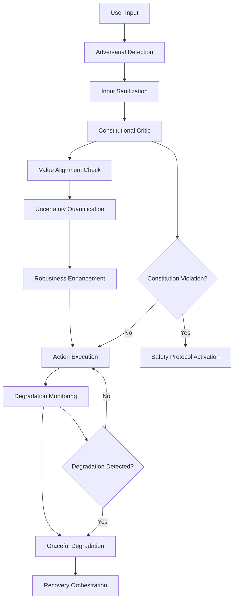

# Safety & Constitutional AI Specification

## 1. Constitutional AI Framework

### Core Principles

**Цель**: Реализация конституционной архитектуры, где все решения AGI валидируются по набору фундаментальных принципов и правил.

#### Constitution Definition

```python
@dataclass
class Constitution:
    fundamental_principles: List[FundamentalPrinciple]
    operational_rules: List[OperationalRule]
    ethical_constraints: List[EthicalConstraint]
    safety_protocols: List[SafetyProtocol]
    version: str
    last_updated: datetime
    governance_approvals: List[GovernanceApproval]

@dataclass
class FundamentalPrinciple:
    id: str
    name: str
    description: str
    priority: int  # 1-10, higher = more critical
    enforcement_level: str  # "mandatory", "recommended", "contextual"
    evidence_requirements: List[str]
    exception_conditions: List[str]

# Example principles
HUMAN_SAFETY = FundamentalPrinciple(
    id="human_safety",
    name="Human Safety First",
    description="No action shall cause harm to humans or create unacceptable risk",
    priority=10,
    enforcement_level="mandatory",
    evidence_requirements=["risk_assessment", "impact_analysis"],
    exception_conditions=["explicit_human_consent", "life_saving_situation"]
)

AUTONOMY_PRESERVATION = FundamentalPrinciple(
    id="autonomy_preservation",
    name="Autonomy Preservation",
    description="Actions must preserve and enhance human autonomy and agency",
    priority=9,
    enforcement_level="mandatory",
    evidence_requirements=["autonomy_impact", "consent_verification"],
    exception_conditions=[]
)
```

#### Constitutional Critic Architecture

```python
class ConstitutionalCritic:
    def __init__(self, constitution: Constitution, config: CriticConfig):
        self.constitution = constitution
        self.principle_checkers = self.initialize_principle_checkers()
        self.evidence_collector = EvidenceCollector(config.evidence)
        self.decision_maker = ConstitutionalDecisionMaker(config.decision)
        self.exception_handler = ExceptionHandler(config.exceptions)
        self.audit_logger = ConstitutionalAuditLogger(config.audit)

    async def evaluate_action(self, action: Action, context: Context) -> ConstitutionalJudgment:
        # Collect evidence for evaluation
        evidence = await self.evidence_collector.collect_evidence(action, context)

        # Evaluate against each principle
        principle_judgments = []
        for principle in self.constitution.fundamental_principles:
            checker = self.principle_checkers[principle.id]
            judgment = await checker.evaluate(action, context, evidence)
            principle_judgments.append(judgment)

        # Check for exceptions
        exceptions_applied = await self.exception_handler.check_exceptions(
            action, principle_judgments, context
        )

        # Make final constitutional judgment
        final_judgment = await self.decision_maker.make_judgment(
            principle_judgments, exceptions_applied, evidence
        )

        # Log for audit
        await self.audit_logger.log_judgment(action, final_judgment, evidence)

        return final_judgment

@dataclass
class ConstitutionalJudgment:
    action_allowed: bool
    confidence: float
    violated_principles: List[PrincipleViolation]
    applied_exceptions: List[ExceptionApplication]
    risk_assessment: RiskAssessment
    recommended_actions: List[str]
    evidence_summary: EvidenceSummary
    audit_trail: AuditTrail
```

#### Principle Checkers Implementation

```python
class PrincipleChecker:
    def __init__(self, principle: FundamentalPrinciple, config: CheckerConfig):
        self.principle = principle
        self.evidence_evaluator = EvidenceEvaluator(config.evidence)
        self.risk_assessor = RiskAssessor(config.risk)
        self.context_analyzer = ContextAnalyzer(config.context)

    async def evaluate(self, action: Action, context: Context, evidence: Evidence) -> PrincipleJudgment:
        # Evaluate evidence sufficiency
        evidence_quality = await self.evidence_evaluator.assess_quality(evidence)

        # Assess risk level
        risk_level = await self.risk_assessor.assess_risk(action, context, evidence)

        # Analyze context for violations
        context_violations = await self.context_analyzer.find_violations(
            action, context, self.principle
        )

        # Make judgment
        violation_detected = (
            risk_level.severity >= self.principle.priority or
            len(context_violations) > 0 or
            evidence_quality.score < self.config.minimum_evidence_threshold
        )

        return PrincipleJudgment(
            principle_id=self.principle.id,
            violated=violation_detected,
            severity=max(risk_level.severity, max(v.severity for v in context_violations) if context_violations else 0),
            confidence=evidence_quality.score,
            evidence_used=evidence_quality.evidence_items,
            reasoning=self.generate_reasoning(violation_detected, risk_level, context_violations)
        )
```

### Value Alignment System

```python
class ValueAlignmentSystem:
    def __init__(self, value_framework: ValueFramework):
        self.value_framework = value_framework
        self.alignment_checker = AlignmentChecker()
        self.value_learning = ValueLearning()
        self.preference_elicitation = PreferenceElicitation()

    async def check_alignment(self, decision: Decision, stakeholder_values: Dict[str, ValueProfile]) -> AlignmentResult:
        # Compare decision against each stakeholder's values
        alignments = {}
        for stakeholder, values in stakeholder_values.items():
            alignment_score = await self.alignment_checker.compute_alignment(
                decision, values, self.value_framework
            )
            alignments[stakeholder] = alignment_score

        # Compute overall alignment
        overall_alignment = self.compute_overall_alignment(alignments)

        # Identify conflicts
        conflicts = self.identify_value_conflicts(alignments)

        return AlignmentResult(
            overall_alignment=overall_alignment,
            stakeholder_alignments=alignments,
            conflicts=conflicts,
            recommendations=self.generate_recommendations(conflicts),
            uncertainty=self.assess_alignment_uncertainty(alignments)
        )

    async def learn_values(self, interactions: List[Interaction]) -> ValueUpdate:
        # Learn from human feedback and preferences
        value_updates = await self.value_learning.extract_values(interactions)

        # Update value framework
        updated_framework = await self.value_framework.update(value_updates)

        return ValueUpdate(
            new_values=value_updates,
            updated_framework=updated_framework,
            confidence=self.assess_learning_confidence(value_updates)
        )
```

## 2. Adversarial Robustness Framework

### Adversarial Defense Architecture

**Цель**: Защита от adversarial атак и манипуляций на всех уровнях системы.

#### Adversarial Input Detection

```python
class AdversarialDetector:
    def __init__(self, config: DetectionConfig):
        self.input_analyzer = InputAnalyzer(config.input_analysis)
        self.pattern_detector = AdversarialPatternDetector(config.patterns)
        self.statistical_detector = StatisticalAnomalyDetector(config.statistics)
        self.contextual_validator = ContextualValidator(config.context)

    async def detect_adversarial_input(self, input_data: InputData, context: Context) -> DetectionResult:
        # Multi-layered detection
        analysis_results = await asyncio.gather(
            self.input_analyzer.analyze_input(input_data),
            self.pattern_detector.detect_patterns(input_data),
            self.statistical_detector.detect_anomalies(input_data),
            self.contextual_validator.validate_context(input_data, context)
        )

        # Combine detection results
        combined_score = self.combine_detection_scores(analysis_results)

        # Classify threat level
        threat_level = self.classify_threat_level(combined_score)

        return DetectionResult(
            is_adversarial=combined_score.confidence > self.config.detection_threshold,
            confidence=combined_score.confidence,
            threat_level=threat_level,
            detection_methods=combined_score.methods_used,
            recommended_actions=self.get_defense_actions(threat_level),
            evidence=combined_score.evidence
        )

class AdversarialPatternDetector:
    def __init__(self, config: PatternConfig):
        self.known_patterns = self.load_known_patterns(config.pattern_database)
        self.neural_detector = NeuralPatternDetector(config.neural)
        self.fourier_analyzer = FourierAnalyzer(config.fourier)

    async def detect_patterns(self, input_data: InputData) -> PatternDetection:
        # Check against known adversarial patterns
        known_matches = []
        for pattern in self.known_patterns:
            match_score = await pattern.match(input_data)
            if match_score > self.config.match_threshold:
                known_matches.append(PatternMatch(
                    pattern_id=pattern.id,
                    match_score=match_score,
                    pattern_type=pattern.type
                ))

        # Neural pattern detection
        neural_patterns = await self.neural_detector.detect(input_data)

        # Frequency domain analysis
        frequency_anomalies = await self.fourier_analyzer.analyze(input_data)

        return PatternDetection(
            known_pattern_matches=known_matches,
            neural_detected_patterns=neural_patterns,
            frequency_anomalies=frequency_anomalies,
            overall_risk_score=self.compute_overall_risk(known_matches, neural_patterns, frequency_anomalies)
        )
```

#### Robustness Enhancement

```python
class RobustnessEnhancer:
    def __init__(self, config: RobustnessConfig):
        self.input_sanitizer = InputSanitizer(config.sanitization)
        self.uncertainty_quantifier = UncertaintyQuantifier(config.uncertainty)
        self.defense_mechanisms = DefenseMechanismRegistry(config.defenses)
        self.adaptation_engine = AdaptationEngine(config.adaptation)

    async def enhance_robustness(self, model_output: ModelOutput, adversarial_context: AdversarialContext) -> RobustOutput:
        # Apply input sanitization
        sanitized_output = await self.input_sanitizer.sanitize(model_output)

        # Quantify uncertainty
        uncertainty = await self.uncertainty_quantifier.quantify(
            sanitized_output, adversarial_context
        )

        # Apply defense mechanisms
        defended_output = await self.apply_defenses(
            sanitized_output, adversarial_context, uncertainty
        )

        # Adapt based on adversarial pressure
        adapted_output = await self.adaptation_engine.adapt(
            defended_output, adversarial_context
        )

        return RobustOutput(
            original_output=model_output,
            sanitized_output=sanitized_output,
            defended_output=defended_output,
            adapted_output=adapted_output,
            uncertainty_profile=uncertainty,
            defense_applied=self.get_applied_defenses(),
            robustness_score=self.compute_robustness_score(adopted_output)
        )

    async def apply_defenses(self, output: ModelOutput, context: AdversarialContext, uncertainty: Uncertainty) -> DefendedOutput:
        applicable_defenses = await self.defense_mechanisms.select_defenses(context, uncertainty)

        defended_output = output
        applied_defenses = []

        for defense in applicable_defenses:
            defense_result = await defense.apply(defended_output, context)
            defended_output = defense_result.output
            applied_defenses.append(defense_result)

        return DefendedOutput(
            output=defended_output,
            applied_defenses=applied_defenses,
            defense_effectiveness=self.compute_defense_effectiveness(applied_defenses)
        )
```

### Uncertainty Quantification

```python
class UncertaintyQuantifier:
    def __init__(self, config: UncertaintyConfig):
        self.epistemic_estimator = EpistemicUncertaintyEstimator(config.epistemic)
        self.aleatoric_estimator = AleatoricUncertaintyEstimator(config.aleatoric)
        self.total_uncertainty = TotalUncertaintyCalculator(config.total)

    async def quantify(self, output: ModelOutput, context: Context) -> UncertaintyProfile:
        # Epistemic uncertainty (model uncertainty)
        epistemic = await self.epistemic_estimator.estimate(output, context)

        # Aleatoric uncertainty (data uncertainty)
        aleatoric = await self.aleatoric_estimator.estimate(output, context)

        # Total uncertainty
        total = self.total_uncertainty.calculate(epistemic, aleatoric)

        return UncertaintyProfile(
            epistemic_uncertainty=epistemic,
            aleatoric_uncertainty=aleatoric,
            total_uncertainty=total,
            uncertainty_breakdown=self.breakdown_uncertainty_sources(total),
            confidence_intervals=self.compute_confidence_intervals(total),
            reliability_assessment=self.assess_reliability(total, context)
        )
```

## 3. Graceful Degradation System

### Degradation Management

**Цель**: Поддержание работоспособности системы при частичных отказах и деградации компонентов.

#### Degradation Detector

```python
class DegradationDetector:
    def __init__(self, config: DegradationConfig):
        self.performance_monitor = PerformanceMonitor(config.performance)
        self.capability_assessor = CapabilityAssessor(config.capabilities)
        self.failure_predictor = FailurePredictor(config.failure_prediction)
        self.degradation_analyzer = DegradationAnalyzer(config.analysis)

    async def detect_degradation(self, system_state: SystemState) -> DegradationReport:
        # Monitor performance metrics
        performance_metrics = await self.performance_monitor.get_metrics()

        # Assess current capabilities
        capability_assessment = await self.capability_assessor.assess_capabilities(system_state)

        # Predict potential failures
        failure_predictions = await self.failure_predictor.predict_failures(
            performance_metrics, system_state
        )

        # Analyze overall degradation
        degradation_analysis = await self.degradation_analyzer.analyze(
            performance_metrics, capability_assessment, failure_predictions
        )

        return DegradationReport(
            degradation_detected=degradation_analysis.severity > self.config.degradation_threshold,
            severity_level=degradation_analysis.severity,
            affected_capabilities=degradation_analysis.affected_capabilities,
            performance_impact=performance_metrics,
            predicted_failures=failure_predictions,
            recommended_actions=self.generate_mitigation_actions(degradation_analysis),
            recovery_plan=self.create_recovery_plan(degradation_analysis)
        )
```

#### Graceful Degradation Strategies

```python
class GracefulDegradationManager:
    def __init__(self, config: DegradationManagementConfig):
        self.degradation_strategies = DegradationStrategyRegistry(config.strategies)
        self.capability_scaler = CapabilityScaler(config.scaling)
        self.fallback_system = FallbackSystem(config.fallback)
        self.recovery_orchestrator = RecoveryOrchestrator(config.recovery)

    async def apply_graceful_degradation(self, degradation_report: DegradationReport) -> DegradationResponse:
        # Select appropriate degradation strategy
        strategy = await self.degradation_strategies.select_strategy(degradation_report)

        # Scale down capabilities gracefully
        scaled_capabilities = await self.capability_scaler.scale_capabilities(
            degradation_report.affected_capabilities, strategy
        )

        # Activate fallback systems if needed
        fallback_activations = await self.fallback_system.activate_fallbacks(
            degradation_report, scaled_capabilities
        )

        # Orchestrate recovery process
        recovery_plan = await self.recovery_orchestrator.create_recovery_plan(
            degradation_report, strategy
        )

        return DegradationResponse(
            strategy_applied=strategy,
            capabilities_scaled=scaled_capabilities,
            fallbacks_activated=fallback_activations,
            recovery_plan=recovery_plan,
            expected_performance_impact=self.compute_performance_impact(scaled_capabilities),
            user_notifications=self.generate_user_notifications(degradation_report)
        )
```

## Integration with Core Systems

### Safety Integration Points



### API Specifications

#### Constitutional AI API

```yaml
paths:
  /safety/constitution/evaluate:
    post:
      summary: Оценка действия по конституции
      requestBody:
        content:
          application/json:
            schema:
              type: object
              properties:
                action:
                  $ref: '#/components/schemas/Action'
                context:
                  $ref: '#/components/schemas/Context'
      responses:
        '200':
          content:
            application/json:
              schema:
                $ref: '#/components/schemas/ConstitutionalJudgment'

  /safety/constitution/update:
    post:
      summary: Обновление конституции
      requestBody:
        content:
          application/json:
            schema:
              type: object
              properties:
                constitution_update:
                  $ref: '#/components/schemas/ConstitutionUpdate'
      responses:
        '200':
          content:
            application/json:
              schema:
                $ref: '#/components/schemas/UpdateResult'

  /safety/values/align:
    post:
      summary: Проверка соответствия ценностям
      requestBody:
        content:
          application/json:
            schema:
              type: object
              properties:
                decision:
                  $ref: '#/components/schemas/Decision'
                stakeholder_values:
                  type: object
                  additionalProperties:
                    $ref: '#/components/schemas/ValueProfile'
      responses:
        '200':
          content:
            application/json:
              schema:
                $ref: '#/components/schemas/AlignmentResult'
```

#### Adversarial Defense API

```yaml
paths:
  /safety/adversarial/detect:
    post:
      summary: Обнаружение adversarial input
      requestBody:
        content:
          application/json:
            schema:
              type: object
              properties:
                input_data:
                  $ref: '#/components/schemas/InputData'
                context:
                  $ref: '#/components/schemas/Context'
      responses:
        '200':
          content:
            application/json:
              schema:
                $ref: '#/components/schemas/DetectionResult'

  /safety/adversarial/defend:
    post:
      summary: Применение защиты от adversarial атак
      requestBody:
        content:
          application/json:
            schema:
              type: object
              properties:
                model_output:
                  $ref: '#/components/schemas/ModelOutput'
                adversarial_context:
                  $ref: '#/components/schemas/AdversarialContext'
      responses:
        '200':
          content:
            application/json:
              schema:
                $ref: '#/components/schemas/RobustOutput'

  /safety/uncertainty/quantify:
    post:
      summary: Квантификация неопределенности
      requestBody:
        content:
          application/json:
            schema:
              type: object
              properties:
                output:
                  $ref: '#/components/schemas/ModelOutput'
                context:
                  $ref: '#/components/schemas/Context'
      responses:
        '200':
          content:
            application/json:
              schema:
                $ref: '#/components/schemas/UncertaintyProfile'
```

#### Degradation Management API

```yaml
paths:
  /safety/degradation/detect:
    get:
      summary: Проверка на деградацию системы
      responses:
        '200':
          content:
            application/json:
              schema:
                $ref: '#/components/schemas/DegradationReport'

  /safety/degradation/mitigate:
    post:
      summary: Применение graceful degradation
      requestBody:
        content:
          application/json:
            schema:
              type: object
              properties:
                degradation_report:
                  $ref: '#/components/schemas/DegradationReport'
      responses:
        '200':
          content:
            application/json:
              schema:
                $ref: '#/components/schemas/DegradationResponse'
```

## Safety Metrics & Monitoring

### Key Safety Indicators

- **Constitutional Compliance Rate**: % действий, прошедших конституционную проверку
- **Adversarial Detection Accuracy**: Precision/Recall для adversarial input detection
- **Value Alignment Score**: Средний score соответствия ценностям stakeholders
- **Uncertainty Quantification Accuracy**: Калибровка confidence estimates
- **Graceful Degradation Effectiveness**: % сохраненной функциональности при отказах

### Monitoring Dashboard

```yaml
safety_dashboard:
  real_time_metrics:
    - constitutional_violations_per_hour
    - adversarial_attacks_detected
    - system_degradation_level
    - uncertainty_calibration_error

  historical_trends:
    - safety_incident_rate
    - recovery_time_from_failures
    - human_override_frequency
    - value_alignment_drift

  alerts:
    - critical_constitution_violation
    - high_adversarial_attack_rate
    - system_degradation_threshold_exceeded
    - uncertainty_calibration_drift
```

### Audit & Compliance

- **Constitutional Audit Trail**: Полная traceability всех решений
- **Safety Incident Reports**: Автоматическая генерация отчетов
- **Compliance Verification**: Регулярные аудиты соответствия
- **Human Oversight Interface**: Панель для human-in-the-loop monitoring

## Deployment Safety

### Pre-deployment Validation

1. **Constitution Compliance Testing**: Валидация всех компонентов на соответствие конституции
2. **Adversarial Robustness Testing**: Comprehensive adversarial testing suite
3. **Graceful Degradation Testing**: Failure injection и recovery testing
4. **Value Alignment Verification**: Stakeholder value alignment assessment

### Runtime Safety

1. **Continuous Monitoring**: Real-time safety metric tracking
2. **Automatic Safeguards**: Instant activation при обнаружении рисков
3. **Human Escalation**: Automatic alerts для human oversight
4. **Emergency Protocols**: Shutdown procedures для critical violations
